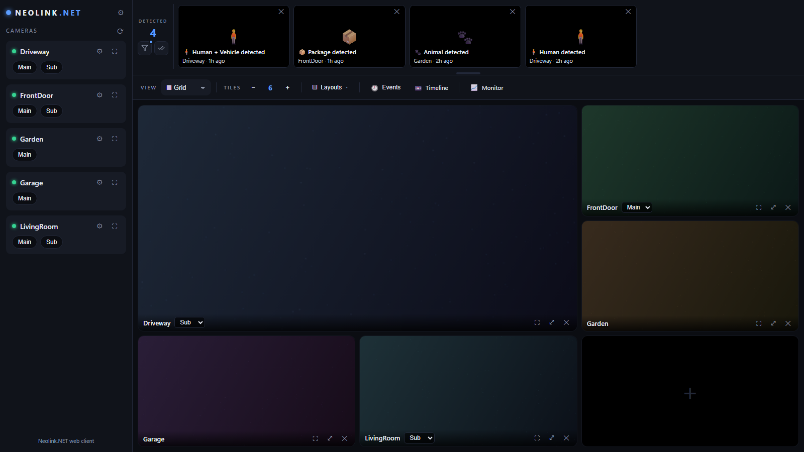
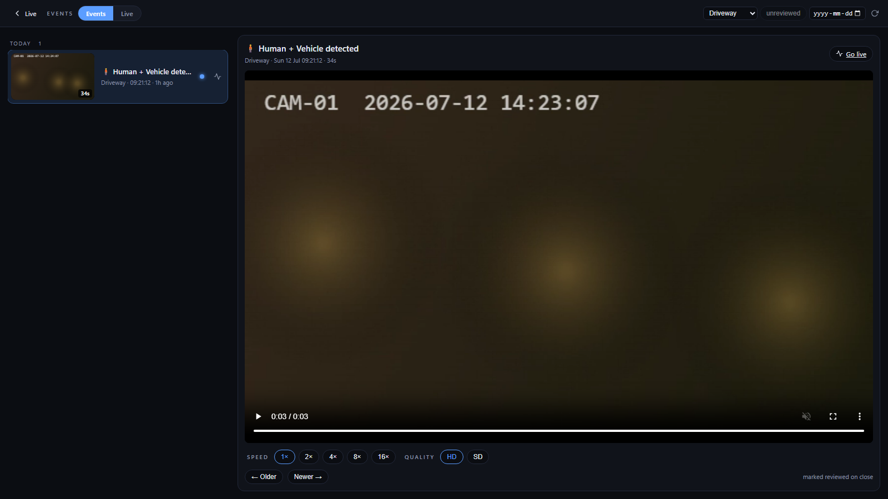
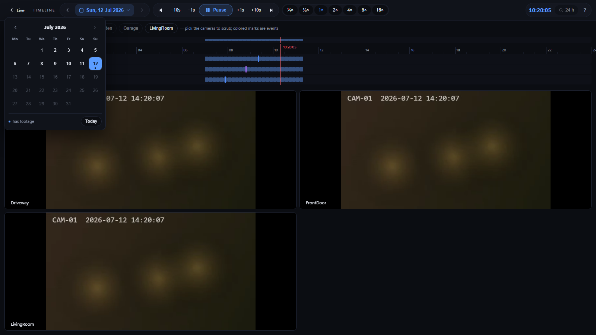
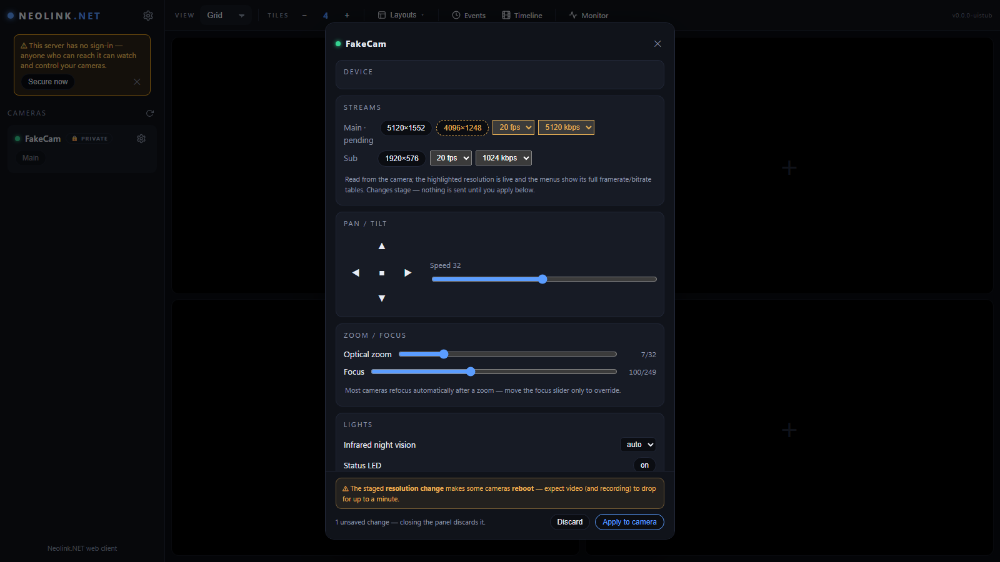

# Neolink.NET

**RTSP bridge + web viewer for Reolink cameras that speak the proprietary Baichuan protocol.**

Neolink.NET is for Reolink IP cameras that talk the proprietary "Baichuan" protocol on
TCP port 9000 instead of standard RTSP/ONVIF (B800/D800, B400/D400, E1, Lumus, 510A,
Duo, TrackMix, and many others).

Your NVR software (**Frigate**, Blue Iris, Home Assistant, Shinobi, VLC, ffmpeg, …) connects to
Neolink.NET, which logs into the camera, demuxes its media stream, and re-serves it as
standards-compliant RTSP. On top of that, Neolink.NET ships a **built-in browser UI** —
a multi-camera wall with live low-latency video, no plugins, no transcoding, no GStreamer —
and a native **MQTT integration for Home Assistant**: each camera appears in HA
automatically (via MQTT Discovery) with motion/person/vehicle/animal sensors, controls,
and availability, driven by the camera's own detections.

The cameras are unmodified and no Reolink NVR is required.

```
┌──────────┐  Baichuan (9000)  ┌─────────────────┐  RTSP (8654)   ┌──────────────────┐
│ Reolink  │ ────────────────► │                 │ ─────────────► │ Frigate / VLC /  │
│ cameras  │                   │   Neolink.NET   │                │ Blue Iris / HA   │
└──────────┘                   │  (one process)  │  HTTP/WS (8655)┌──────────────────┐
                               │                 │ ─────────────► │ Browser web UI   │
                               └─────────────────┘                └──────────────────┘
```



<table>
  <tr>
    <td width="33%"><a href="docs/events.png"></a><br><sub><b>Events page</b> — deep-linkable review, 1–16× playback, HD/SD</sub></td>
    <td width="33%"><a href="docs/timeline.png"></a><br><sub><b>Timeline</b> — synced scrubbing, event marks, footage calendar</sub></td>
    <td width="33%"><a href="docs/camera-settings.png"></a><br><sub><b>Camera settings</b> — staged changes, applied only when you say so</sub></td>
  </tr>
</table>

*All screenshots show synthetic demo footage.*

> ### A note on camera coverage
>
> Reolink ships a large and ever-growing range of cameras, and their firmwares
> genuinely differ — the same feature can work on one model, answer differently
> on the next, and be broken outright on a third. Neolink.NET is developed and
> tested against the cameras **I actually own**, which is a handful, not the
> catalogue: cameras are expensive, and I maintain this project alone in my
> spare time. So: everything here works on the models it was built against;
> on models I've never touched, it *should* work, but I simply cannot promise
> it until someone with that hardware tells me.
>
> **This is where you come in.** If your camera misbehaves, an issue with logs
> is genuinely valuable — most model-specific quirks in this project were found
> and fixed exactly that way. And if you can go one step further, **pull
> requests are very welcome**: a fix validated on hardware I don't have is the
> one contribution I cannot make myself.

## Quick start (Home Assistant add-on)

Running Home Assistant OS (or Supervised)? Neolink.NET installs as a native
add-on — no Docker commands, no YAML files:

[](https://my.home-assistant.io/redirect/supervisor_add_addon_repository/?repository_url=https%3A%2F%2Fgithub.com%2Fborexola%2Fneolink.net)

1. Click the badge (or Settings → Add-ons → Add-on Store → ⋮ → Repositories →
   add `https://github.com/borexola/neolink.net`), then install **Neolink.NET**.
2. Add your cameras in the add-on's *Configuration* tab (name, IP, account).
3. Start it and click **OPEN WEB UI**.

If the **Mosquitto broker** add-on is installed, the MQTT connection is wired
up automatically at every start — cameras appear as Home Assistant devices with
no further setup. Recordings land in `/media/neolink`, so clips show up in HA's
media browser. Full details in the add-on's Documentation tab
([neolink-addon/DOCS.md](neolink-addon/DOCS.md)).

Running Home Assistant in a plain container (no Supervisor)? Use the Docker
route below — everything works the same, including the MQTT integration.

## Quick start (Docker — recommended)

Prebuilt multi-arch images (`linux/amd64` + `linux/arm64`) are published to GitHub
Container Registry on every push to `main` and every `v*` release tag.

### 1. Pull the image

```bash
docker pull ghcr.io/borexola/neolink.net:latest
```

Available tags:

| Tag | Meaning |
|---|---|
| `latest` | most recent build of `main` |
| `0.6.0`, `0.6` | a specific release (created from `v0.6.0` git tags) — pin these in production |
| `main` | same as `latest`, explicit branch tag |
| `beta` | rolling pre-release test channel (built from the `beta` branch) — try new features early; not for production |

Docker selects the right architecture (x86-64 server, Raspberry Pi 4/5, ARM NAS)
automatically. Verify the pull:

```bash
docker image inspect ghcr.io/borexola/neolink.net:latest --format '{{.Os}}/{{.Architecture}} {{.Created}}'
```

> **`denied` or `unauthorized` when pulling?** The package is public, so no login is
> needed. If you see this on a fresh setup you are likely logged into ghcr.io with an
> expired token — run `docker logout ghcr.io` and pull again.
> **`manifest unknown`?** The tag doesn't exist (typo, or a release tag that hasn't
> been built yet) — check the available tags on the
> [package page](https://github.com/borexola/neolink.net/pkgs/container/neolink.net).

### 2. Create a config

```bash
mkdir -p config
curl -o config/config.json https://raw.githubusercontent.com/borexola/neolink.net/main/src/Neolink.Server/config.example.json
```

Edit it: camera names, IP addresses, and credentials (same login as the Reolink app).

> **New to it?** You can skip this step. If `config.json` doesn't exist on
> first start, Neolink.NET writes a commented starter config and boots straight to
> the web UI (empty, no crash-loop) — then edit `config.json` to add your
> cameras and restart. Handy for one-click installs (Unraid, Portainer).

### 3. Run

```bash
# /config is a directory mount: config.json lives in it, and runtime settings
# from the web UI (settings.json) are persisted next to it.
# TZ sets the time zone for timestamps and the UI clock (defaults to UTC).
docker run -d --name neolink --restart unless-stopped \
    -p 8654:8654 -p 8655:8655 \
    -e TZ=Europe/London \
    -v "$PWD/config:/config" \
    ghcr.io/borexola/neolink.net:latest
```

Then check it came up:

```bash
docker logs -f neolink     # prints the ready-to-use RTSP and web UI URLs
```

- **Web UI**: http://localhost:8655
- **RTSP**: `rtsp://localhost:8654/<camera-name>`

### Or with compose

Save this as `docker-compose.yml` next to your `config/` directory
(or `curl -O https://raw.githubusercontent.com/borexola/neolink.net/main/docker-compose.yml`):

```yaml
services:
  neolink:
    image: ghcr.io/borexola/neolink.net:latest
    container_name: neolink
    restart: unless-stopped
    environment:
      - TZ=Europe/London   # time zone for timestamps + the UI clock (defaults to UTC)
    ports:
      - "8654:8654"   # RTSP (TCP-interleaved works for ffmpeg/Frigate/VLC)
      - "8655:8655"   # web UI + API; remove if webui:false and API unused
    volumes:
      - ./config:/config   # holds config.json + web-UI settings.json
      # Recording storage — uncomment and set "recording": { "path": "/recordings" } in config.json:
      # - ./recordings:/recordings
      # Optional tiered storage (see "Tiered storage" below). Map a volume for EVERY tier
      # path you set, or that footage lands inside the container and is lost on recreate:
      # - /mnt/fast-ssd/neolink:/clips     # fast SSD tier  → "clips_path": "/clips"
      # - /mnt/bigdisk/neolink:/archive    # cold archive   → "archive_path": "/archive"
    # Host networking instead of port maps — REQUIRED for UDP-only battery
    # cameras ("udp": true), and needed for RTSP over UDP transport. Delete the
    # `ports:` block above when you enable it. See "UDP-only battery models".
    # network_mode: host
```

Then:

```bash
docker compose up -d
docker compose logs -f    # shows the rtsp:// and web UI URLs
```

### Unraid

An Unraid [Community Applications](https://forums.unraid.net/topic/38582-plug-in-community-applications/)
template ships in [`unraid/`](unraid/). Add
`https://github.com/borexola/neolink.net` under **Apps → Settings → Template
Repositories**, then search **Neolink.NET** in *Apps* — or paste the raw
[template URL](https://raw.githubusercontent.com/borexola/neolink.net/main/unraid/neolink.net.xml)
into **Docker → Add Container**. First start writes a starter config and opens
the web UI; edit `config.json` in the Config share to add cameras. See
[unraid/README.md](unraid/README.md).

### Upgrading

```bash
docker pull ghcr.io/borexola/neolink.net:latest
docker rm -f neolink
docker run -d --name neolink ...   # same run command as above
# or, with compose:
docker compose pull && docker compose up -d
```

### Building the image from source

```bash
git clone https://github.com/borexola/neolink.net.git && cd neolink.net
docker build -t neolink.net .
docker run -d --name neolink -p 8654:8654 -p 8655:8655 \
    -v "$PWD/config:/config" neolink.net
```

Then:
- **Web UI**: http://localhost:8655
- **RTSP**: `rtsp://localhost:8654/<camera-name>`

> **When you need host networking** (`network_mode: host`, or `--network host`,
> instead of port mapping): for [UDP-only battery
> cameras](#udp-only-battery-models-beta) — where it is required, not optional —
> and for RTSP over **UDP** transport. Everything else, including TCP-interleaved
> RTSP (the default for ffmpeg/Frigate, and `--rtsp-tcp` in VLC), works fine with
> plain port mapping.

## Quick start (from source)

Requires the [.NET 10 SDK](https://dotnet.microsoft.com/download).

```bash
git clone https://github.com/borexola/neolink.net.git
cd neolink.net
cp src/Neolink.Server/config.example.json src/Neolink.Server/config.json  # edit it
dotnet run --project src/Neolink.Server -c Release
```

Single-file, self-contained binaries:

```bash
dotnet publish src/Neolink.Server -c Release -r linux-x64    # or win-x64, linux-arm64, ...
```

## Lightweight by design — the camera does the heavy lifting

Neolink.NET runs no object detection of its own: it never decodes, transcodes, or
analyses a single video frame for motion or AI. All of that already happens *on
the camera*, whose dedicated silicon detects motion and classifies people,
vehicles and animals in real time. Neolink.NET simply **listens for the alarm
messages the camera pushes** over the Baichuan connection (the same events that
drive Reolink's own app) and relays them to Home Assistant as MQTT sensors — and
doorbell button presses as MQTT events. That means:

- **No GPU, no Coral, no CPU-hungry inference** — unlike setups where a server
  re-analyses every stream, Neolink.NET adds essentially zero processing load. It
  runs comfortably on a Raspberry Pi or a small NAS container.
- **Event-driven, not polled** — sensors fire the instant the camera sees
  something, with no scan interval and no per-frame work.
- **AI is only as good as the camera** — person/vehicle/animal labels come from
  the camera's firmware, so enable the detection types you want in the Reolink
  app and Neolink.NET surfaces exactly those.

The trade-off is that detection quality and available classes are whatever your
camera model provides (rather than a tunable server-side model like Frigate's);
in exchange you get an integration light enough to leave running forever.

## Features

**RTSP bridge**
- H.264 / H.265 and AAC are **repackaged, never re-encoded**; ADPCM audio is
  decoded to PCM (L16)
- TCP-interleaved and UDP transports, RTSP Basic auth, per-camera permissions
- One camera connection feeds any number of clients (cameras fall over at ~2–3
  direct connections); slow clients are isolated and can never affect the
  camera or other viewers

**Web UI (optional, built in)** — full tour in [docs/web-ui.md](docs/web-ui.md)
- Live low-latency video (~1 s, fMP4 over WebSocket + MSE — no plugins, no
  transcoding), live audio, opt-in **two-way talk**
- Camera wall with five layouts (Grid, Focus, Mosaic, Theater, Free),
  per-tile stream choice, maximize and fullscreen
- **Camera settings & controls** discovered from the camera itself: PTZ,
  zoom/focus, lights, siren, privacy mode, reboot — plus, over the HTTP API
  (beta), picture settings, HDR, volume, detection sensitivity, OSD, PTZ
  presets, quick replies and a firmware-update badge. Changes stage and are
  sent only on "Apply to camera"; a **PORTS tab** can enable the camera's own
  HTTP/ONVIF services right from Neolink
- **Events** review strip and deep-linkable events page, a synced
  multi-camera **Timeline** with footage export, and **camera SD-card
  playback** (preview)
- **Perimeter protection**: line-crossing / intrusion / loitering alerts from
  the Reolink app become their own event types — opt-in per camera under
  *Event types* (an untouched setup records what it always did); they get
  their own icons in the strip
- **AI event descriptions (BETA)**: a vision LLM writes what happened plus a
  GREEN/YELLOW/RED threat level — see
  [AI event descriptions](#ai-event-descriptions--beta)
- **Battery cameras** (BETA) auto-detected and sleep-friendly — see
  [Battery cameras](#battery-cameras-argus-etc--beta)
- **Tiered storage** (SSD clips tier + cold archive, capacity watching and
  fill forecasts — see [Tiered storage](#tiered-storage-optional)),
  **footage encryption at rest** (beta), **email alerts** for critical
  conditions ([Email notifications](#email-notifications)) and per-user
  **browser alerts**

**Home Assistant / MQTT (optional)** — full guide in
[docs/home-assistant.md](docs/home-assistant.md)
- A **device per camera appears automatically** (MQTT Discovery, no YAML):
  detection sensors driven by the camera's own pushes, controls, battery and
  sleep state, recording switches, record-on-demand, doorbell press events,
  and a Last-event sensor for notification deep links
- Two-level availability with retained state; a dozing battery camera stays
  *available* with an **Asleep** sensor saying why. MQTT 3.1.1 is spoken
  natively — no external library

**Protocol / robustness**
- Full login handshake including modern encryption: BCEncrypt (XOR),
  AES-128-CFB, and **FullAes** (2023+ firmwares with encrypted media streams)
- Automatic reconnection with backoff; media-stream resynchronization (a
  corrupt packet skips forward instead of tearing the connection down)
- A crash in one camera's pipeline can never take down other cameras or the
  process
- Zero native dependencies, zero NuGet packages — builds fully offline

## Stream URLs

| URL | Content |
|---|---|
| `rtsp://host:8654/driveway` | main stream (alias) |
| `rtsp://host:8654/driveway/mainStream` | main stream (high resolution) |
| `rtsp://host:8654/driveway/subStream` | sub stream (low resolution) |
| `http://host:8655/` | web UI |
| `http://host:8655/api/cameras` | JSON list of cameras and stream state |
| `ws://host:8655/api/stream?path=/driveway/subStream` | live fMP4 (MSE-compatible) |
| `GET /api/cameras/driveway/capabilities` | device info + discovered features (ptz/led/pir/battery) |
| `GET /api/cameras/driveway/streaminfo` | encode profiles: resolution, framerate/bitrate options |
| `GET /api/cameras/driveway/battery` | battery charge/status (battery cameras) |
| `GET`/`POST /api/cameras/driveway/led` | status LED & floodlight — `{"state":"open"}`, `{"lightState":"close"}` |
| `GET`/`POST /api/cameras/driveway/pir` | PIR motion sensor — `{"enabled":true}` |
| `POST /api/cameras/driveway/ptz` | pan/tilt — `{"command":"left","speed":32}` (`up/down/left/right/stop`) |
| `POST /api/cameras/driveway/reboot` | reboot the camera |
| `POST /api/cameras/driveway/wake-hint` | external "the camera is up for an event" signal (battery cameras — see the battery guide) |

`POST` (control) endpoints require HTTP **Basic auth** when `users` are configured,
honouring the same per-camera `permitted_users` rules as RTSP; with no users
configured they are open, like everything else. Feature discovery is live: the
server probes the camera once per connection and the web UI only shows the
controls the camera actually supports.

### RTSP audio backchannel (two-way talk without the web UI)

Cameras with a speaker also expose an **ONVIF Profile-T audio backchannel** on the
same RTSP mount, so [go2rtc](https://github.com/AlexxIT/go2rtc), Home Assistant's
WebRTC Camera and other ONVIF-aware clients can talk through the camera. A client
that sends `Require: www.onvif.org/ver20/backchannel` on `DESCRIBE` is offered an
extra sendonly `PCMU/8000` track; the G.711 audio it streams is decoded and fed to
the same talk pipeline the web UI's mic button uses. Plain players (VLC, ffmpeg)
never see the extra track — it only appears when a client asks for it.

It rides the two-way-talk opt-in: set `"ui": { "talk": true }` (or *Server settings
→ Web UI → Two-way talk*). Example go2rtc source:

```yaml
streams:
  driveway:
    - rtsp://<neolink-host>:8654/driveway#backchannel=1
```

## Configuration

JSON with comments and trailing commas allowed — see
[config.example.json](src/Neolink.Server/config.example.json). Legacy TOML configs from
the original Rust neolink are also accepted.

### Top level

| Option | Default | Description |
|---|---|---|
| `bind` | `0.0.0.0` | Address to serve on |
| `bind_port` | `8654` | RTSP port |
| `web_port` | `8655` | Web UI + HTTP/WS API port; `0` disables both |
| `webui` | `true` | Serve the browser UI on `web_port`; `false` = API only |
| `web_bind` | = `bind` | Separate bind address for the web port |
| `users` | *(none)* | **RTSP** Basic-auth users: `{ "name", "pass" }`. Omit for open access. Separate from web-UI accounts! |
| `recording` | *(none)* | Event recording (see below). Omit to disable |
| `mqtt` | *(none)* | MQTT / Home Assistant integration (see below). Omit to disable |
| `ui` | *(defaults)* | Web-UI specific settings (see below) |

### Web-UI settings (`"ui": { ... }`)

| Option | Default | Description |
|---|---|---|
| `enabled` / `port` / `bind` | = `webui` / `web_port` / `web_bind` | Grouped aliases of the top-level web options |
| `state_dir` | config dir | Where the UI's server-side state persists: `users.json` (sign-in accounts) and `settings.json` (per-user layouts/filters/recording switches) |
| `reset_admin_password` | `false` | Recovery: while `true`, the login screen allows setting a new admin password. Turn it back off after use |
| `trickle_speed` | `4` | Playback speed of the review strip's ambient clip previews |

> **Persistence across deployments** — three locations must live on volumes or
> your state resets every deploy: **(1)** the config directory (or `ui.state_dir`)
> holding `users.json` + `settings.json` — lose it and accounts, layouts and
> filters reset; **(2)** the `recording.path` directory — lose it and footage
> *and the reviewed/dismissed state* (stored in each event's `event.json`) reset,
> so previously dismissed events reappear; **(3)** `config.json` itself. The
> docker-compose example mounts (1)+(3) via `./config:/config`; uncomment its
> `./recordings:/recordings` line for (2) when you turn on recording.

### Web UI sign-in

Authentication is **off by default** — no database, no config required. The
first visitor is prompted to create the **admin** account (or dismiss and do it
later via ⚙ → "Enable login…"); creating it turns sign-in on for the whole UI
and API. Accounts live in `users.json` next to your config: passwords are
stored as PBKDF2-SHA256 (210k iterations, per-user salt, constant-time
verification — safe for an open-source, file-based setup), and sessions are
HMAC-signed tokens that expire after 30 days and are invalidated the moment a
password changes.

The admin manages accounts from ⚙ → Users…: add normal users, change any
password, delete users (the admin itself can't be deleted). **Every account
keeps its own UI settings** — layout, tiles, review-strip filters — stored
server-side, so people don't fight over one shared view. Forgot the admin
password? Set `"reset_admin_password": true` in the config, restart, use
"Reset admin password…" on the login screen, then set the flag back to
`false`.

The admin also gets ⚙ → **Server settings…**: a form that edits most of
`config.json` (network ports, web UI, recording) and writes it back to the file
(atomically, keeping a `.bak`; comments are not preserved, and RTSP users still
need a text editor). The **Cameras** tab (beta) adds, edits and deletes cameras
from the same panel — Reolink and generic RTSP alike — with live validation, a
**Test connection** button (a real Baichuan login for Reolink; an RTSP
round-trip for generic URLs), and write-only passwords: a stored password is
never sent to the browser, and leaving the field blank keeps it. Saved changes
apply on the next restart, which the admin can trigger with **Restart
service…** — the process exits and your container/systemd restart policy brings
it back within seconds while the UI reconnects on its own. When a newer release
exists on GitHub, a dismissable banner links to it.

### Recording (`"recording": { ... }`)

> 💾 **Slow disks are handled**: all recording I/O runs on dedicated
> low-priority writer threads behind a bounded memory budget, so an HDD that
> stalls (cache flushes, spin-ups, network shares) can never lag the service or
> the live streams — if the disk falls behind, *recorded* frames are dropped
> (with a log warning) and recording resumes at the next keyframe.

Two recording modes, both switchable **per camera at runtime** from the web UI
(camera ⚙ → RECORDING) — the switches persist in `settings.json` next to your
config file (in Docker: the `/config` mount), so they survive restarts:

- **Detection events**: the camera's own motion/AI detections (person, vehicle,
  animal — pushed over the Baichuan connection, no polling and no server-side ML)
  become labeled events with video clips and thumbnails. New events appear in a
  review strip at the top of the web UI; click to play, ✕ to dismiss. The 🕘
  Events button opens the full history grouped by day. Per camera you can also
  pick **which detection types to record** (🧍 person, 🚗 vehicle, 🐾 animal,
  📦 package, 😢 crying, 👁 motion) — detections of disabled types are discarded
  entirely. Crying is the audio detection indoor cams offer (E1 series and
  friends): the camera hears crying through its mic and pushes it like any
  other smart detection.
  ⚠ The camera does the detecting: person/vehicle/animal labels only arrive when
  the matching Smart Detection is enabled **in the Reolink app** (camera →
  Settings → Detection). The chips are a Neolink.NET-side filter on what arrives;
  the camera's own settings are never changed.
- **Continuous (24/7)**: classic NVR-style recording into rolling
  `segment_minutes`-long MP4 files, browsable under 🕘 → Recordings (grouped by
  day, click to play). Off by default; enable per camera in the UI.

| Option | Default | Description |
|---|---|---|
| `path` | *required* | Storage directory. In Docker, mount a volume here (e.g. `./recordings:/recordings`) |
| `clips_path` | = `path` | Optional fast tier: new event clips are written here (point it at an SSD for snappy event playback); continuous footage stays on `path` |
| `archive_path` | *unset* | Optional cold tier: enables per-camera archiving — aged footage is **moved** here instead of deleted. Use a different (bigger/slower) drive; in Docker, map a second volume (e.g. `-v /mnt/bigdisk:/archive`) |
| `retention_days` | `7` | Events older than this are deleted (`0` = keep forever) |
| `pre_seconds` | `5` | Video included from before the detection (pre-roll) |
| `post_seconds` | `8` | Quiet time after the last detection before the event closes |
| `max_clip_seconds` | `120` | Hard cap per event; continued activity starts a new event |
| `stream` | `auto` | Stream to record: `auto` (main if served), `mainStream`, `subStream` |
| `segment_minutes` | `10` | Continuous recording: time limit for one segment file |
| `max_segment_size_mb` | `256` | Continuous recording: size limit for one segment file — a new file starts at the next keyframe once the segment reaches this size *or* `segment_minutes`, whichever comes first (keeps high-bitrate streams from producing huge files) |
| `continuous_retention_days` | = `retention_days` | Days to keep continuous footage (`0` = forever) |
| `encrypt` | `false` | **Beta:** encrypt new footage at rest (AES-256-GCM) — see [Encrypting footage](#encrypting-footage-beta) |

Everything is fragmented MP4 (H.264/H.265 passthrough, video-only) playable in
the browser and by ffmpeg/VLC. Storage layout is plain files, with everything
for one camera-day under a single date folder —
`recordings/<camera>/<date>/detections/<time>-<id>/{event.json, clip.mp4, thumb.jpg, preview.mp4}`
for events and `recordings/<camera>/<date>/continuous/<HH-mm-ss>.mp4` for 24/7
footage — so backups and external tooling are trivial. Recordings from older
versions (events directly under the date folder, continuous under
`<camera>/continuous/<date>`) are migrated to this layout automatically on
startup — directory renames, instant regardless of footage size. Set
`"record": false` on a camera to start with events off (the UI switch can
re-enable it).

#### Tiered storage (optional)

Everything works with the single `path` folder — the tiers below are strictly
opt-in and existing setups keep behaving exactly as before:

- **Fast clips tier** (`clips_path`): point it at an SSD and new event clips
  land there for instant review scrubbing, while bulky 24/7 footage stays on
  the big disk.
- **Archive tier** (`archive_path`): once set, each camera's ⚙ → RECORDING
  section gains **Archive event clips** and **Archive continuous footage**
  switches. Retention stays the single clock: when footage reaches the end of
  its retention window, an enabled type is **moved** to the archive instead of
  deleted (e.g. "Keep event clips: 30" moves clips to the archive on day 30).
  One extra knob sets how long the archive keeps footage (blank = forever).
  The events list and the timeline read archived footage transparently. Use a
  different drive for the archive — in Docker, map a second volume
  (e.g. `-v /mnt/bigdisk:/archive` with `"archive_path": "/archive"`;
  `docker-compose.yml` ships commented examples for both tiers). On the Home
  Assistant add-on no extra mapping is needed: point `archive_path` at a
  folder under `/share` or `/media` — NAS shares added in HA under
  Settings → System → Storage appear there automatically.
  While an archive pass moves footage, admins see it live: a
  **background-process strip** in the live view's sidebar (under the storage
  banners) shows what is being archived — camera, day, bytes moved — with a
  progress bar and percentage, and disappears when the pass finishes. The same
  strip is the home for any future long-running server work admins should know
  about (`GET /api/background` serves it; admin-only once accounts exist).

Capacity is watched for you: when any configured location climbs past **90%
used**, the web UI shows an amber warning banner; if one actually runs out of
space, recording to it halts cleanly (no partial files) with a **red** banner
until space is freed — recording resumes automatically. When split storage is
configured, the 📈 Monitor page grows a STORAGE section showing every
location's free space live.

The Monitor also **forecasts when each disk fills**: free space is sampled
every 15 minutes (persisted across restarts, up to a week of trend), and the
DISK FREE card and each storage card show *"fills in ~23 days at the current
rate"*. The projection is the **net** trend, not the raw write rate — so once
retention starts deleting as fast as the cameras record, it honestly says
*"not filling at the current rate"* instead of inventing a fill date. A fresh
install says nothing for the first ~6 hours while it gathers data
(`GET /api/storage` carries the same numbers: `forecastState`/`forecastDays`).

#### Encrypting footage (beta)

Opt-in encryption at rest for everything the server records: turn on
**Server settings → Recording → Encrypt footage (beta)** (or set
`"recording": { "encrypt": true }`) and restart. From then on new event clips,
ambient previews, thumbnails and 24/7 segments are written as chunked
**AES-256-GCM** — a stolen disk, a NAS share mounted elsewhere, or a copied
backup exposes nothing, and any in-place tampering is detected on read.

- **Playback is unaffected.** Files decrypt transparently when served: live
  timeline scrubbing, seeking (HTTP range requests decrypt only the chunks a
  seek touches), event previews and downloads/exports all behave exactly as
  before. AES-GCM is hardware-accelerated, so the cost is a fraction of a
  percent of one core even at main-stream bitrates.
- **Old footage keeps playing.** The format is sniffed per file: plaintext
  recordings from before the switch (or after turning it back off) are served
  raw forever, side by side with encrypted ones. Nothing is re-encrypted or
  migrated. Footage recorded while encryption was ON also keeps playing after
  turning it OFF — the key stays available either way.
- **The key** is derived from the server secret: the `NEOLINK_SECRET_KEY`
  environment variable (32 bytes, base64/hex — the recommended way: the key
  then never touches the footage disk) or the auto-generated `secret.key` in
  the state dir. **Back it up** — without it, encrypted footage is
  unrecoverable, by design. If `secret.key` lives on the same disk as the
  recordings, a thief gets both: prefer the env var, or keep the state dir on
  the OS disk.
- **What it does not do:** event metadata (`event.json` — labels and
  timestamps, no imagery) stays plaintext so the index stays cheap; exports
  are decrypted downloads by definition; and like any at-rest encryption it
  cannot protect against an attacker with full access to the *running* host.
  If you control the machine, full-disk encryption (LUKS, BitLocker, ZFS)
  gives the same guarantee for the whole system — this feature is for setups
  where you can't control the volume (e.g. the HA add-on on an existing disk).

> ⚠ **Docker: map a volume for every configured tier.** Missing directories
> are created at startup so recording never blocks — but if a configured
> container path has no volume behind it, that directory lands in the
> container's writable layer: footage records fine yet lives inside the
> container (gone on `docker rm`) and fills the Docker host's disk. If the
> Monitor's STORAGE section shows a tier with the same capacity as the root
> disk, that's the sign.

### Per camera

| Option | Default | Description |
|---|---|---|
| `name` | *required* | Name used in the RTSP URL and web UI |
| `address` | *required* | Camera IP/hostname; port defaults to `9000` |
| `http_address` | *derived from `address`* | The camera's HTTP(S) web interface (`host`, `host:port` or full URL). Only needed to override the host/port — the HTTP API is otherwise reached on the `address` host, port 80. Unlocks picture settings, volume, PTZ presets, OSD, detection sensitivity, SD-card browsing and stream-profile changes |
| `onvif_address` | *derived from `address`* | The camera's ONVIF device service (`host`, `host:port` or full URL). Only needed to override the port — ONVIF is otherwise probed on port 8000, then 80. A picture-settings fallback for models with no HTTP API (Lumus line) |
| `username` / `password` | *required* | The camera's own login (same as the Reolink app) |
| `stream` | `both` | `mainStream`, `subStream`, `externStream`, `both`, or `all` |
| `channel_id` | `0` | Channel when connecting through a Reolink NVR (0-based) |
| `permitted_users` | all users | Restrict this camera's mounts to specific `users` |
| `record` | `true` | Initial default for this camera's "Detection events" switch (changeable in the web UI) |

> **Keep camera passwords alphanumeric.** Reolink's HTTP API — the one behind
> `http_address`, picture settings, volume, PTZ presets and scaled snapshots —
> is far pickier about the password than the video protocol. Some special
> characters (`@ : / % & + #` and others, varying by firmware) make the HTTP
> login fail with `password wrong` **even though the exact same password works
> for live video and in the camera's own web page**. The result is a camera
> that streams and records perfectly but whose HTTP-backed features silently go
> missing (the log warns once that the HTTP API "REJECTED the login"). If you
> hit this, set the camera's password to letters and digits only (`a–z A–Z
> 0–9`) in the Reolink app — this is a camera-firmware quirk, not a Neolink.NET
> limitation, and the reference Reolink libraries recommend the same. Passwords
> over 31 characters can fail for the same reason.

### Enable HTTP and ONVIF on the camera for the full feature set

Neolink.NET streams and records over Baichuan (port 9000), which needs nothing
extra — but the camera's *optional* HTTP and ONVIF services unlock the rest of
the control surface, and both are worth turning on. **You can do it from
Neolink itself**: the camera's ⚙ panel has a **PORTS tab** that reads the
camera's live service table and can enable HTTP or ONVIF right there (admin
only, behind a confirmation — the Baichuan port itself is never touchable).
The same switches live in the Reolink app under *Settings → Network → Advanced
→ Port Settings*. The `http_address` / `onvif_address` config keys are only
needed for non-standard hosts/ports — otherwise both services are found on the
camera's own IP automatically.

- **HTTP (or HTTPS)** is where most settings live: picture sliders, day-night,
  HDR, speaker volume, Wi-Fi signal, PTZ presets, the on-screen display,
  detection sensitivity, SD-card browsing/playback, stream-profile changes,
  and right-sized snapshots. Off = the camera still streams and records
  perfectly; those panels are simply absent. If HTTP is on but features are
  missing, the log says exactly why (a rejected login usually means a special
  character in the password — see the note above).
- **ONVIF** matters most on models with no HTTP API (the Lumus line): its
  imaging service is the **fallback** for the picture sliders and day-night
  mode. Reolink serves it on port 8000; leave the default and it is found
  automatically. It covers imaging basics only, so it complements HTTP rather
  than replacing it.

Neither interface weakens LAN security beyond what the Reolink app already
uses (same camera login), and neither is required for core video or recording.

## Behind a reverse proxy (HAProxy / nginx / Caddy)

The web UI works behind a TLS-terminating reverse proxy (e.g. HAProxy on
OPNsense) pointing at `web_port`. Two things matter:

- **WebSocket upgrade** must be allowed for `/_blazor` (the UI's interactive
  circuit) and `/api/stream` (live video). Most proxies pass the `Upgrade`
  header by default; in HAProxy make sure the backend has a generous
  `timeout tunnel` (e.g. `1h`) so long-lived streams aren't cut.
- **The container never needs to reach its own public URL.** The UI runs on
  Blazor Server, so its API calls execute *inside* the container; when the
  configured server address is the page's own origin, those calls
  automatically short-circuit to loopback instead of going back out through
  the proxy — no hairpin NAT, split DNS, or internal-CA trust required.
  (Symptom of the old behaviour: the page loads but the camera list shows
  "Cannot reach https://… The SSL connection could not be established".)

Only the browser-facing traffic (the page, the live-video WebSocket, event
clips/thumbnails) traverses the proxy, so your TLS certificate only needs to
be valid for the browser.

## Home Assistant (MQTT)

> ### 📖 Full guide: **[docs/home-assistant.md](docs/home-assistant.md)** —
> all options, the full entity table, on-demand recording, notification deep
> links, packet sizing, and snapshots over HTTP.

Add an `mqtt` section and a **device per camera** appears in Home Assistant
automatically via MQTT Discovery — no YAML. Detection `binary_sensor`s are
driven by the camera's own pushes (event-driven, no polling); controls
(floodlight, siren, PTZ, privacy mode, reboot), battery and **Asleep** state,
recording switches, **record on demand**, doorbell press events and a
**Last event** sensor for notification deep links round it out. A separate
server device carries health and storage sensors. MQTT 3.1.1 is spoken
natively — no external library, retained state, two-level availability.

```json
"mqtt": { "broker": "192.168.1.10", "username": "neolink", "password": "secret" }
```

## Email notifications

For the things you want to hear about even when you're not looking at a
dashboard, Neolink.NET can email **critical alerts**. It's off until you opt in:
open ⚙ **Server settings → Notifications**, turn it on, enter one recipient
address and your SMTP details, and **Send test email** to confirm. Settings
apply immediately (no restart) and are stored separately from `config.json`.

All alerts default on once enabled; disable any you don't want. Each is
**edge-triggered and de-duplicated** — you get one email when a condition starts
(re-reminded at most every 6 hours while it persists) and a short "resolved"
follow-up when it clears:

| Alert | Fires when |
|---|---|
| Storage full / recovered | A recording drive runs out of space and recording halts; then when space is freed |
| Server overload | CPU stays near maximum for several minutes |
| Camera offline / back online | A camera is unreachable longer than its threshold (default 10 min, **configurable per camera**; 0 = never); then when it reconnects. Battery cameras dozing are not treated as an outage |
| Recording write failures | Footage fails to write to disk — a failing/disconnected drive or a permissions problem (distinct from "full") |

**Isolation:** the notifier runs on its own background task and swallows every
error, so a wrong or unreachable mail server only logs a warning — it can never
affect recording, streaming or MQTT.

**SMTP transport:** STARTTLS (587) and implicit SSL/TLS (465) are both
supported, with `AUTH LOGIN`. Use a provider **app password** where offered
(Gmail, Outlook, etc.) rather than your main account password.

**About the password at rest.** The SMTP password is encrypted with AES-256-GCM;
the key is an owner-only `secret.key` in the state dir, or the
`NEOLINK_SECRET_KEY` environment variable if set (so the key can live only in
the environment). It is write-only in the UI and never returned by the API.
Be aware of the inherent limit: to send email the app must be able to recover
the password, so this protects it against casual disk/backup exposure but **not**
against someone who already has full read access to the server's files (they'd
have both the key and the ciphertext). That trade-off is unavoidable for any
self-hosted app that sends its own authenticated email.

## AI event descriptions — BETA

> ### 📖 Full guide: **[docs/ai-descriptions.md](docs/ai-descriptions.md)**

Point Neolink.NET at a vision-capable LLM and every detection event gets a
written description and a **GREEN / YELLOW / RED threat classification** — in
the web UI (banner in the event players, colored dots on event rows), in the
event metadata (`/api/events`), and in Home Assistant (per-camera **Last AI
description** and **AI threat level** sensors, the automation hook for
"notify loudly on RED").

The short version:

- **Enable** it globally in Settings → **AI** (backend, endpoint, model — any
  **vision-capable** model your backend runs), then per camera under
  camera ⚙ → EVENTS. Tested with **llama.cpp**, **Ollama** and
  **LM Studio**; Anthropic-style APIs are implemented to spec. It's
  **beta — feedback is very welcome**.
- **Frames come from the stream itself** when an ffmpeg is present (the
  Docker image ships one): a passive keyframe tap that costs the camera
  nothing, plus up to three **pre-roll frames from the moments before the
  trigger** — usually the best look at whatever caused the event. Without
  ffmpeg, the camera's own snapshot command carries the event as before.
  Frames **spread across the whole event** and the model is told each one's
  time offset; the sampling density and per-event frame cap in Settings → AI
  are the quality levers, paid for in answer latency.
- **Tune it to your property**: per-camera **scene notes** (what this camera
  watches, what is normal there) are the biggest threat-level win, and the
  instruction prompt sets the global voice. The classification contract is
  appended automatically so your edits can't break it.
- Descriptions run on an isolated background queue: a slow or dead model can
  never delay recording or streaming — at worst an event goes undescribed
  with a log line.

## Using with Frigate

```yaml
cameras:
  driveway:
    ffmpeg:
      inputs:
        - path: rtsp://<neolink-host>:8654/driveway/subStream
          roles: [detect]
        - path: rtsp://<neolink-host>:8654/driveway/mainStream
          roles: [record]
```

Neolink.NET keeps exactly one connection per camera stream regardless of how many
Frigate roles/consumers attach, and hands stalled ffmpeg processes a hard disconnect
within 10 s so Frigate's watchdog recovers quickly. For headless Frigate boxes set
`"webui": false` (or `"web_port": 0`).

## Battery cameras (Argus etc.) — BETA

> ### 📖 Full guide: **[docs/battery-cameras.md](docs/battery-cameras.md)**
>
> Setup for all three modes (constant power, battery, battery + router wake
> hints), every setting, what gets recorded where, and troubleshooting.

**Beta — under active development and testing.** Validated against real
hardware, but sleep behavior varies by model and is still being tuned against
field logs — open an issue with the `[wake-diag]` log lines if yours
misbehaves.

The short version:

- A camera that reports a battery is **auto-detected** and defaults to
  **sleep-friendly mode**: Neolink.NET disconnects while nobody watches
  (connection time is battery), shows an "asleep" badge, and reconnects when
  you open a stream.
- On solar/USB power, set `"always_on": true` — the camera then behaves
  exactly like a wired one (permanent connection, 24/7 recording, live
  events).
- On battery, `"wake_capture": true` catches motion events while it sleeps,
  and your network can feed **instant wake hints** (`wake_hints` in the
  config): OPNsense/pfSense forward their firewall log, or — on any router
  with DNS overrides (OpenWRT, Pi-hole, AdGuard, …) — point
  `pushx.reolink.com` at Neolink itself and the camera's own event push
  becomes the signal. The DNS route costs you Reolink app notifications
  (Home Assistant takes over), and push must be turned **on** in the app
  *before* the DNS change — step-by-step in the guide.
- A sleeping camera **cannot be woken from the network** — it wakes itself
  on PIR — and it always keeps recording events to its own SD card.

### UDP-only battery models (beta)

Some battery models (parts of the Argus line) never listen on TCP — they log
`Connection refused` forever and a port scan shows no open ports. They speak
Baichuan **over UDP** instead:

```jsonc
{
  "name": "Retro",
  "username": "admin",
  "password": "…",
  "address": "192.168.178.50",
  "uid": "95270000ABCDEFGH",
  "udp": true
}
```

| | |
|---|---|
| `"uid"` | the camera's UID (Reolink app → device info, or the sticker) |
| `"udp": true` | selects the UDP transport |
| `"address"` | its LAN IP — give it a DHCP reservation |
| **host networking** | **in Docker/Podman: `network_mode: host` (compose) or `--network host` (run). Not optional** |

Host networking is required because the Baichuan UDP handshake carries the
client's port *inside* the packet and discovery relies on LAN broadcast —
neither survives a bridge network. The tell in the log is a discovery sweep
listing only container-internal broadcast addresses (`172.x.255.255`) ending
in `UDP: SILENCE`. Drop the `ports:` / `-p` mappings when you switch — with
host networking they do nothing and can collide. Once connected, everything
works as over TCP (video, events, battery, recording, controls); these
cameras carry a **UDP BETA** badge in the UI.

Validated against real hardware (Argus Eco Pro) — with thanks to
**[Rihan9](https://github.com/Rihan9)**, whose patient testing and log captures
across many beta rounds pinned down the protocol's keepalive and session
behavior and made this support work
([#39](https://github.com/borexola/neolink.net/issues/39)).

## Web UI

> ### 📖 Full guide: **[docs/web-ui.md](docs/web-ui.md)** — layouts, the
> camera settings panel, events/timeline/export, SD-card playback, PWA
> install, browser alerts, two-way talk, studio layout.

The built-in browser UI is a multi-camera wall with ~1 s live video (fMP4
over WebSocket — no plugins, no transcoding), an event review strip, a synced
multi-camera timeline with export, and per-camera settings discovered from
the camera itself. It installs as an app (PWA), works behind a TLS reverse
proxy, and every account keeps its own layouts server-side.

## Versioning & releases

The app's version lives in one place — `<Version>` in
`src/Neolink.Server/Neolink.Server.csproj` — and shows up everywhere: the
startup log, `neolink.net --version`, `/api/features`, and the bottom of the
web UI's sidebar. **Releasing = pushing a git tag**: tag `vX.Y.Z` and the
docker workflow builds the multi-arch images with that exact version baked in
(`-p:Version` from the tag), so every release increments the reported version
without a code change. Untagged builds report the csproj version.

Pushing to the **`beta` branch** publishes `ghcr.io/borexola/neolink.net:beta`
— a rolling pre-release channel, separate from `latest` and the version tags —
for trying new features before a stable release.

## Self-tests & development

> ### 📖 Full guide: **[docs/development.md](docs/development.md)** — the
> fake-camera simulator, testing uncommitted changes on a real server, and
> the project layout.

```bash
dotnet run --project src/Neolink.Server -- selftest
```

The built-in suite needs no hardware and also runs inside every published
image (`docker run --rm ghcr.io/borexola/neolink.net:latest selftest`).

## Troubleshooting

- Run with `--verbose` (or `NEOLINK_LOG=debug`) for protocol-level logging.
- **`503 Service Unavailable` on DESCRIBE / web tiles stuck on "connecting…"**: the
  camera is not connected yet (wrong address/credentials, camera booting) — check the
  service logs.
- **"authentication failed … retrying in 30s"**: the camera rejected the configured
  username/password. Cameras also reject transiently while rebooting or when their user
  table is full, so the bridge keeps retrying at a slow pace. Five wrong attempts can
  lock the account for a few minutes.
- **"Connection closed while waiting for message ID 1"**: usually an encryption
  negotiation problem — make sure you're on the latest build (FullAes support).
- **Video works but picture settings / volume / scaled snapshots are missing,
  and the log says the HTTP API "REJECTED the login"**: the camera's HTTP API
  is refusing a password the video protocol accepts. Almost always a special
  character (or a password over 31 chars) — set the camera's password to
  letters and digits only in the Reolink app. See *Per camera* above.
- **"the camera's HTTP API is not answering … responds too slowly"**: the HTTP
  port is open but the camera stalled — common for a Wi-Fi camera busy pushing
  video. Reads resume automatically when it recovers; nothing to do unless it
  never recovers (then check the camera's Wi-Fi signal, or set a wired
  `http_address`).
- **A UDP camera (`"udp": true`) times out while every other camera works, and
  the discovery sweep ends in `UDP: SILENCE`**: in Docker, the container is on a
  bridge network — UDP-only cameras need `network_mode: host` / `--network host`
  (see [UDP-only battery models](#udp-only-battery-models-beta)). Read the
  sweep's `targets:` line to confirm: if the only broadcast address is
  container-internal (`172.x.255.255`) and none is on the camera's subnet, that
  is the cause.
- Cameras limit concurrent Baichuan clients; if the Reolink app is streaming
  `mainStream`, use `stream: "subStream"` or close the app.
- **Choppy browser video on Firefox for main streams**: that's H.265 — use the sub
  stream or a Chromium/Safari browser with hardware HEVC.
- **Configured `clips_path`/`archive_path` but the folders look empty on the
  host (Docker)**: recording never blocks on a missing directory — Neolink.NET
  creates it at startup. If no volume is mapped at that container path, the
  directory is created **inside the container's writable layer**: footage
  records fine but lives in the container (surviving restarts, destroyed by
  `docker rm`) and eats the Docker host's disk. Map a volume for every
  configured tier. The Monitor page's STORAGE section is the tell: tiers on
  the container layer report the same total/free bytes as the root disk.
- **Perimeter events (line crossing / intrusion / loitering) don't appear**:
  they are opt-in — tick them under the camera's ⚙ → *Event types* first
  (they need perimeter protection configured in the Reolink app). If the
  camera still produces none, set `NEOLINK_DEBUG_ALARMS=1`, trip the line
  once, and open an issue with the logged `alarm push <AlarmEventList …>`
  XML lines so the mapping can be extended.

## Compared to the original Rust neolink

Improvements: built-in web UI, no GStreamer/native dependencies, no transcoding of AAC,
per-client backpressure, in-stream resynchronization.

Not (yet) supported: TLS for RTSP (`rtsps://` — put a TLS-terminating proxy in front)
and the UID/UDP discovery + relay transport (battery cameras work over direct TCP —
see [Battery cameras](#battery-cameras-argus-etc--beta) — but cameras reachable ONLY via
Reolink's P2P relay are not). The auxiliary features (PIR, reboot, status LED,
two-way talk) are covered by the web UI and API instead of CLI subcommands.

## Project status & disclaimer

Neolink.NET is a personal project. I built it for my own use because the existing
options did not fully meet my needs, and I publish it in the hope that it is useful
to others in the same situation.

It is developed and validated on the cameras I personally own — a small slice of
Reolink's range. Firmware behavior varies meaningfully between models (see *A note
on camera coverage* at the top), and I cannot buy every camera to test against;
reports with logs, and especially pull requests validated on hardware I do not
have, are the most effective way to get a model-specific problem fixed.

**It is provided "as is", without warranty of any kind** — no guarantee of
correctness, reliability, security, or fitness for a particular purpose, and no
commitment to support, maintenance, or timely fixes. Evaluate it against your own
requirements before depending on it, particularly where security footage or
around-the-clock monitoring matters. Issues and pull requests are welcome and
handled on a best-effort basis. The [license](LICENSE) contains the formal
warranty and liability disclaimers.

## Sponsorship

If Neolink.NET saves you or your business time, sponsorship funds the hours and the
hardware that keep it moving. Buying cameras I do not own is the single biggest
unlock for supporting more models, and it is the reason most model-specific gaps stay
open. [Sponsor Neolink.NET](https://github.com/sponsors/borexola).

## Credits & license

Inspired by, and a pure C#/.NET reimplementation of, the original
[Neolink](https://github.com/thirtythreeforty/neolink) project by
[@thirtythreeforty](https://github.com/thirtythreeforty), whose reverse
engineering of the Baichuan protocol made all of this possible, and its
actively maintained fork
[QuantumEntangledAndy/neolink](https://github.com/QuantumEntangledAndy/neolink)
— the reference for AES/FullAes and modern camera behavior. Neolink.NET began
as a port and remains deeply indebted to both.

This project is a derivative port and is licensed under the
[GNU Affero General Public License v3.0](LICENSE), the same license as the
original. Neolink.NET is not affiliated with or endorsed by Reolink.
