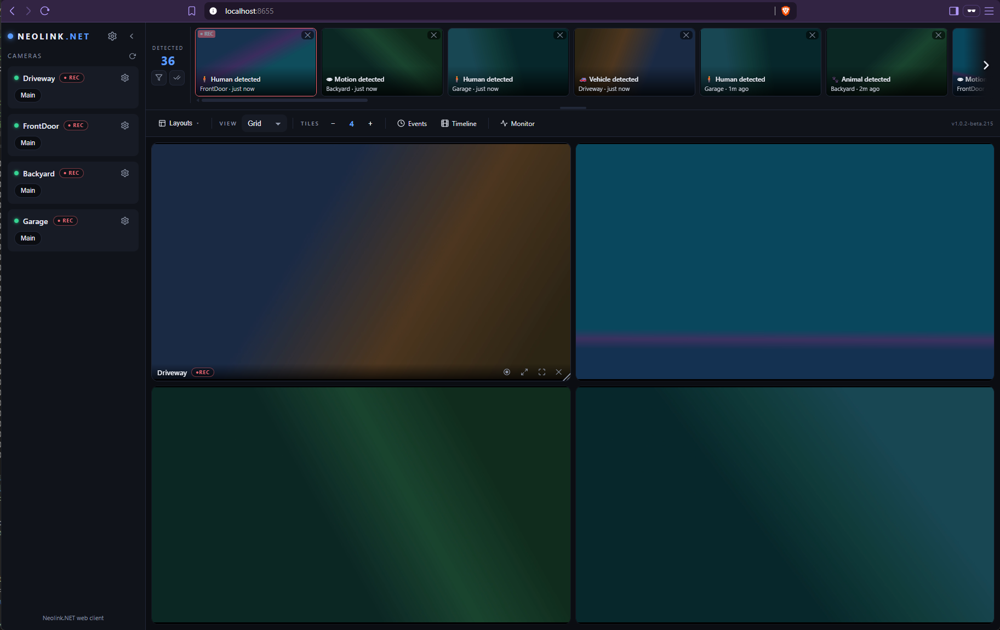
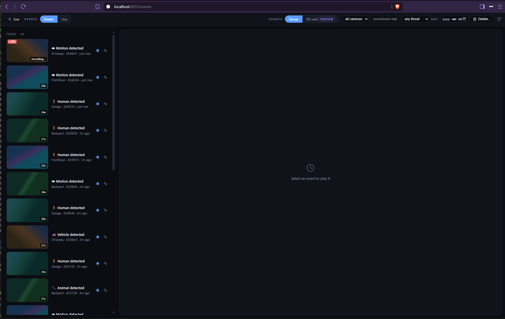
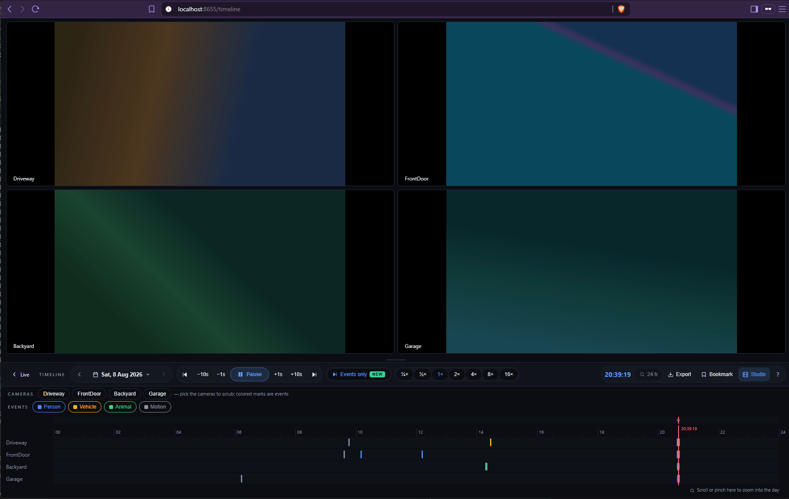
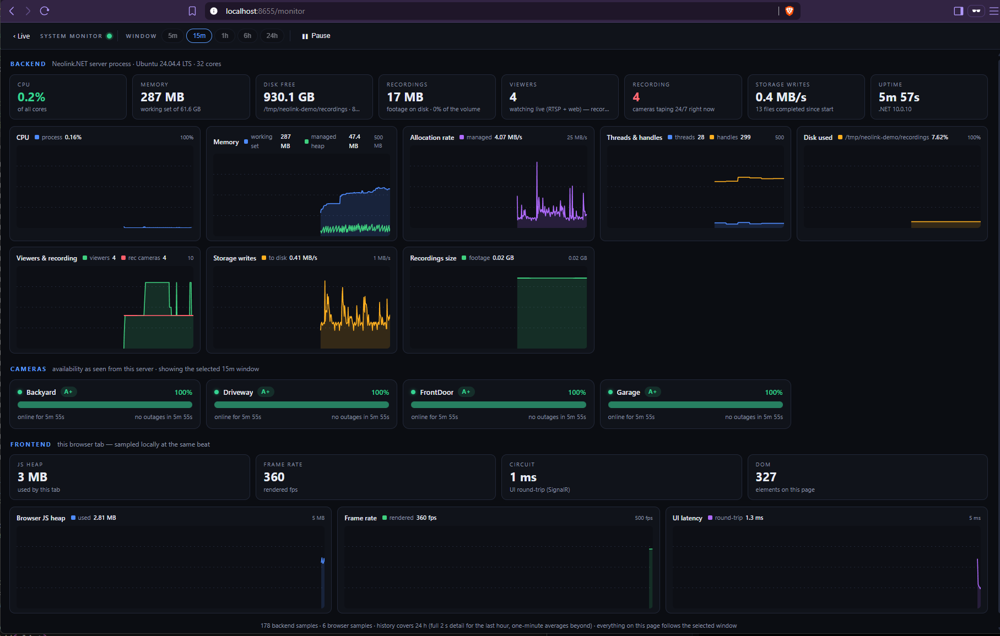
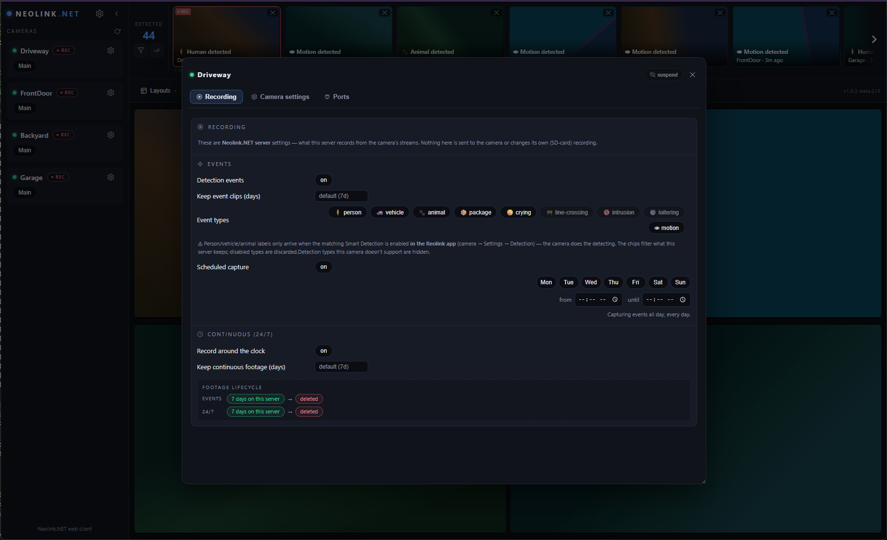
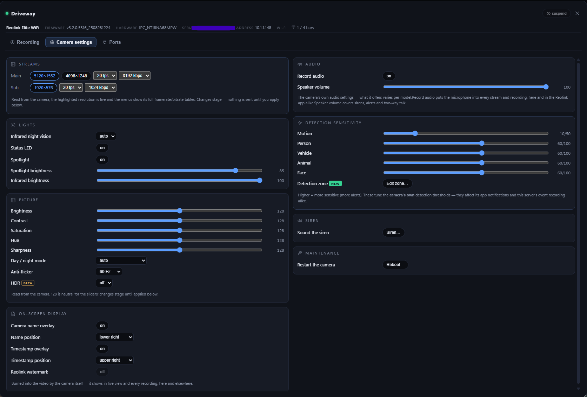

# Neolink.NET

**English** · [Français](docs/translations/README.fr.md) · [Deutsch](docs/translations/README.de.md) · [Español](docs/translations/README.es.md) · [Nederlands](docs/translations/README.nl.md) · [Polski](docs/translations/README.pl.md) · [Português](docs/translations/README.pt.md)

**RTSP bridge + web viewer for Reolink cameras that speak the proprietary Baichuan protocol.**

Neolink.NET is for Reolink IP cameras that talk the proprietary "Baichuan" protocol on
TCP port 9000 instead of standard RTSP/ONVIF (B800/D800, B400/D400, E1, Lumus, 510A,
Duo, TrackMix, and many others).

Your NVR software (**Frigate**, Blue Iris, Home Assistant, Shinobi, VLC, ffmpeg, …) connects to
Neolink.NET, which logs into the camera, demuxes its media stream, and re-serves it as
standards-compliant RTSP. On top of that, Neolink.NET ships a **built-in browser UI** —
a multi-camera wall with live low-latency video, no plugins, no transcoding, no GStreamer —
and a native **MQTT integration for Home Assistant**: each camera appears in HA
automatically (via MQTT Discovery) with motion/person/vehicle/animal sensors, controls,
and availability, driven by the camera's own detections.

The cameras are unmodified and no Reolink NVR is required.

```
┌──────────┐  Baichuan (9000)  ┌─────────────────┐  RTSP (8654)   ┌──────────────────┐
│ Reolink  │ ────────────────► │                 │ ─────────────► │ Frigate / VLC /  │
│ cameras  │                   │   Neolink.NET   │                │ Blue Iris / HA   │
└──────────┘                   │  (one process)  │  HTTP/WS (8655)┌──────────────────┐
                               │                 │ ─────────────► │ Browser web UI   │
                               └─────────────────┘                └──────────────────┘
```



<table>
  <tr>
    <td width="20%"><a href="docs/screenshot-2.png"></a><br><sub><b>Events page</b> — deep-linkable review, filters, 1–16× playback</sub></td>
    <td width="20%"><a href="docs/screenshot-3.png"></a><br><sub><b>Timeline</b> — synced scrubbing, event marks, export</sub></td>
    <td width="20%"><a href="docs/screenshot-4.png"></a><br><sub><b>Monitor</b> — server health, camera uptime, fill forecasts</sub></td>
    <td width="20%"><a href="docs/screenshot-5.png"></a><br><sub><b>Recording setup</b> — events, 24/7, lifecycle, per camera</sub></td>
    <td width="20%"><a href="docs/camera-settings-2.png"></a><br><sub><b>Camera settings</b> — staged changes, applied only when you say so</sub></td>
  </tr>
</table>

*All screenshots show synthetic demo footage.*

> ### A note on camera coverage
>
> Reolink ships a large and ever-growing range of cameras, and their firmwares
> genuinely differ — the same feature can work on one model, answer differently
> on the next, and be broken outright on a third. Neolink.NET is developed and
> tested against the cameras **I actually own**, which is a handful, not the
> catalogue: cameras are expensive, and I maintain this project alone in my
> spare time. So: everything here works on the models it was built against;
> on models I've never touched, it *should* work, but I simply cannot promise
> it until someone with that hardware tells me.
>
> **This is where you come in.** If your camera misbehaves, an issue with logs
> is genuinely valuable — most model-specific quirks in this project were found
> and fixed exactly that way. And if you can go one step further, **pull
> requests are very welcome**: a fix validated on hardware I don't have is the
> one contribution I cannot make myself.

## Try it first — no cameras, no config

```bash
docker run --rm -p 8655:8655 ghcr.io/borexola/neolink.net:latest --demo
```

Open <http://localhost:8655> and you're looking at the real product with a fake
world behind it: **four synthetic cameras** with live moving video, detections
firing every minute or two, a seeded event history, 24/7 recordings scrubbing
on the timeline. No real footage anywhere, nothing saved — the demo world
lives in a temp folder, resets itself every six hours, and vanishes with the
container. The same showroom runs on bare metal too: `neolink.net --demo`
(needs ffmpeg on PATH).

## Quick start (Home Assistant add-on)

Running Home Assistant OS (or Supervised)? Neolink.NET installs as a native
add-on — no Docker commands, no YAML files:

[](https://my.home-assistant.io/redirect/supervisor_add_addon_repository/?repository_url=https%3A%2F%2Fgithub.com%2Fborexola%2Fneolink.net)

1. Click the badge (or Settings → Add-ons → Add-on Store → ⋮ → Repositories →
   add `https://github.com/borexola/neolink.net`), then install **Neolink.NET**.
2. Add your cameras in the add-on's *Configuration* tab (name, IP, account).
3. Start it and click **OPEN WEB UI**.

If the **Mosquitto broker** add-on is installed, the MQTT connection is wired
up automatically at every start — cameras appear as Home Assistant devices with
no further setup. Recordings land in `/media/neolink`, so clips show up in HA's
media browser. Full details in the add-on's Documentation tab
([neolink-addon/DOCS.md](neolink-addon/DOCS.md)).

**Prefer to write the config yourself?** Empty the add-on's camera list
(`cameras: []`) and it stops touching `cameras` — then edit `config.json` in
`/addon_configs/…_neolink/` (Samba/SSH/Studio Code Server) and restart. That
folder also holds `settings.json` and the rest of the UI state. Every option
below works there; a `//` comment in the file stops the add-on merging
anything at all, MQTT included. For a NAS, add it under Settings → System →
Storage and point `path`/`archive_path` at `/media/<share>` or
`/share/<share>` — add-ons cannot take Docker-style volume mappings.

Running Home Assistant in a plain container (no Supervisor)? Use the Docker
route below — everything works the same, including the MQTT integration.

## Quick start (Docker — recommended)

> ### 📖 Full guide: **[docs/docker-install.md](docs/docker-install.md)** — image
> tags, docker compose, Unraid template, upgrading, building the image yourself.

```bash
mkdir -p config
docker run -d --name neolink --restart unless-stopped \
    -p 8654:8654 -p 8655:8655 \
    -e TZ=Europe/London \
    -v "$PWD/config:/config" \
    ghcr.io/borexola/neolink.net:latest
```

First start writes a commented starter config into `config/` and opens the
**web UI at <http://localhost:8655>** — add your cameras under Server settings
(the gear icon) with the same login you use in the Reolink app, restart, and
streams serve at `rtsp://localhost:8654/<camera-name>`. Images are multi-arch
(`amd64` + `arm64`: x86 servers, Raspberry Pi 4/5, ARM NAS); pin a version tag
like `:1.0.1` in production.

> Host networking (`--network host`) is required for
> [UDP-only battery cameras](#udp-only-battery-models-beta) and RTSP over UDP
> transport — everything else works with plain port mapping.

## Quick start (Windows — no Docker)

> ### 📖 Step-by-step with screenshots: **[docs/windows-install.md](docs/windows-install.md)**
> — every click from download to your cameras on screen.

One MSI, two shapes. Download `Neolink.NET.Desktop-X.Y.Z-win-x64.msi` from the
[releases page](https://github.com/borexola/neolink.net/releases) and run it:

- **Desktop monitoring** — the default install is the [desktop
  app](#windows-desktop-app--beta): your camera wall in its own window, real
  Windows notifications from the tray, pointed at a server you already run
  (Docker, the add-on, another machine).
- **A complete standalone system** — tick **Local server (Windows service)**
  on the feature page and the same MSI installs the full server as a Windows
  service: recording and serving your cameras 24/7, signed in or not, with
  nothing else to install. The desktop app connects to it at
  `http://localhost:8655`, and cameras, accounts and recording all get set up
  from the web UI there.

The MSI is not code-signed yet, so SmartScreen shows *"Windows protected your
PC"* on first run — click **More info** → **Run anyway**. Details in the
[desktop guide](docs/desktop-app.md).

## Quick start (from source)

Requires the [.NET 10 SDK](https://dotnet.microsoft.com/download).

```bash
git clone https://github.com/borexola/neolink.net.git
cd neolink.net
cp src/Neolink.Server/config.example.json src/Neolink.Server/config.json  # edit it
dotnet run --project src/Neolink.Server -c Release
```

Single-file, self-contained binaries:

```bash
dotnet publish src/Neolink.Server -c Release -r linux-x64    # or win-x64, linux-arm64, ...
```

## Lightweight by design — the camera does the heavy lifting

Neolink.NET runs no object detection of its own: it never decodes, transcodes, or
analyses a single video frame for motion or AI. All of that already happens *on
the camera*, whose dedicated silicon detects motion and classifies people,
vehicles and animals in real time. Neolink.NET simply **listens for the alarm
messages the camera pushes** over the Baichuan connection (the same events that
drive Reolink's own app) and relays them to Home Assistant as MQTT sensors — and
doorbell button presses as MQTT events. That means:

- **No GPU, no Coral, no CPU-hungry inference** — unlike setups where a server
  re-analyses every stream, Neolink.NET adds essentially zero processing load. It
  runs comfortably on a Raspberry Pi or a small NAS container.
- **Event-driven, not polled** — sensors fire the instant the camera sees
  something, with no scan interval and no per-frame work.
- **AI is only as good as the camera** — person/vehicle/animal labels come from
  the camera's firmware, so enable the detection types you want in the Reolink
  app and Neolink.NET surfaces exactly those.

The trade-off is that detection quality and available classes are whatever your
camera model provides (rather than a tunable server-side model like Frigate's);
in exchange you get an integration light enough to leave running forever.

## Features

**RTSP bridge**
- H.264 / H.265 and AAC are **repackaged, never re-encoded**; ADPCM audio is
  decoded to PCM (L16)
- TCP-interleaved and UDP transports, RTSP Basic auth, per-camera permissions
- One camera connection feeds any number of clients (cameras fall over at ~2–3
  direct connections); slow clients are isolated and can never affect the
  camera or other viewers

**Web UI (optional, built in)** — full tour in [docs/web-ui.md](docs/web-ui.md)
- Live low-latency video (~1 s, fMP4 over WebSocket + MSE — no plugins, no
  transcoding), live audio, opt-in **two-way talk**
- Camera wall with five layouts (Grid, Focus, Mosaic, Theater, Free),
  per-tile stream choice, maximize and fullscreen
- **Camera settings & controls** discovered from the camera itself: PTZ,
  zoom/focus, lights, siren, privacy mode, reboot, detection sensitivity and
  infrared brightness — plus, over the HTTP API (beta), picture settings, HDR,
  volume, OSD, PTZ presets, quick replies and a firmware-update badge. Changes stage and are
  sent only on "Apply to camera"; a **PORTS tab** can enable the camera's own
  HTTP/ONVIF services right from Neolink
- **Events** review strip and deep-linkable events page, a synced
  multi-camera **Timeline** with footage export, and **camera SD-card
  playback** (preview)
- **Perimeter protection**: line-crossing / intrusion / loitering alerts from
  the Reolink app become their own event types — opt-in per camera under
  *Event types* (an untouched setup records what it always did); they get
  their own icons in the strip
- **AI event descriptions (BETA)**: a vision LLM writes what happened plus a
  GREEN/YELLOW/RED threat level — see
  [AI event descriptions](#ai-event-descriptions--beta)
- **AI Search (BETA)**: search events in plain language ("people wearing
  something red last week") — structured filters parse instantly, the LLM
  matches descriptions; see [AI Search](docs/ai-descriptions.md#ai-search-beta)
- **Battery cameras** (BETA) auto-detected and sleep-friendly — see
  [Battery cameras](#battery-cameras-argus-etc--beta)
- **Tiered storage** (SSD clips tier + cold archive, capacity watching and
  fill forecasts — see [Tiered storage](docs/recording.md#tiered-storage-optional)),
  **footage encryption at rest**, **email alerts** for critical
  conditions ([Email notifications](#email-notifications)) and per-user
  **browser alerts**
- **Multiple languages** — English, French, German, Spanish, Dutch, Polish and
  Portuguese. Picked at first-run setup or under ⚙ → Language, applied live
  (no restart, no reload); each account keeps its own choice and the admin sets
  the server default for the sign-in screen. Non-English languages are
  AI-translated and cannot be fully verified — corrections welcome

**Home Assistant / MQTT (optional)** — full guide in
[docs/home-assistant.md](docs/home-assistant.md)
- A **device per camera appears automatically** (MQTT Discovery, no YAML):
  detection sensors driven by the camera's own pushes, controls, battery and
  sleep state, recording switches, record-on-demand, doorbell press events,
  and a Last-event sensor for notification deep links
- Two-level availability with retained state; a dozing battery camera stays
  *available* with an **Asleep** sensor saying why. MQTT 3.1.1 is spoken
  natively — no external library

**Protocol / robustness**
- Full login handshake including modern encryption: BCEncrypt (XOR),
  AES-128-CFB, and **FullAes** (2023+ firmwares with encrypted media streams)
- Automatic reconnection with backoff; media-stream resynchronization (a
  corrupt packet skips forward instead of tearing the connection down)
- A crash in one camera's pipeline can never take down other cameras or the
  process
- Zero native dependencies, zero NuGet packages — builds fully offline

## Stream URLs

| URL | Content |
|---|---|
| `rtsp://host:8654/driveway` | main stream (alias) |
| `rtsp://host:8654/driveway/mainStream` | main stream (high resolution) |
| `rtsp://host:8654/driveway/subStream` | sub stream (low resolution) |
| `rtsp://host:8654/driveway?audio=opus` | same stream, audio transcoded to **Opus** (WebRTC-friendly; needs ffmpeg) — works on any camera path; `?audio=original` forces the camera's own track |
| `http://host:8655/` | web UI |
| `http://host:8655/api/cameras` | JSON list of cameras and stream state |
| `ws://host:8655/api/stream?path=/driveway/subStream` | live fMP4 (MSE-compatible) |
| `GET /api/cameras/driveway/capabilities` | device info + discovered features (ptz/led/pir/battery) |
| `GET /api/cameras/driveway/streaminfo` | encode profiles: resolution, framerate/bitrate options |
| `GET /api/cameras/driveway/battery` | battery charge/status (battery cameras) |
| `GET`/`POST /api/cameras/driveway/led` | status LED & floodlight — `{"state":"open"}`, `{"lightState":"close"}` |
| `GET`/`POST /api/cameras/driveway/pir` | PIR motion sensor — `{"enabled":true}` |
| `POST /api/cameras/driveway/ptz` | pan/tilt — `{"command":"left","speed":32}` (`up/down/left/right/stop`) |
| `POST /api/cameras/driveway/reboot` | reboot the camera |
| `POST /api/cameras/driveway/wake-hint` | external "the camera is up for an event" signal (battery cameras — see the battery guide) |

`POST` (control) endpoints require HTTP **Basic auth** when `users` are configured,
honouring the same per-camera `permitted_users` rules as RTSP; with no users
configured they are open, like everything else. Feature discovery is live: the
server probes the camera once per connection and the web UI only shows the
controls the camera actually supports.

### RTSP audio backchannel (two-way talk without the web UI)

Cameras with a speaker also expose an **ONVIF Profile-T audio backchannel** on the
same RTSP mount, so [go2rtc](https://github.com/AlexxIT/go2rtc), Home Assistant's
WebRTC Camera and other ONVIF-aware clients can talk through the camera. A client
that sends `Require: www.onvif.org/ver20/backchannel` on `DESCRIBE` is offered an
extra sendonly `PCMU/8000` track; the G.711 audio it streams is decoded and fed to
the same talk pipeline the web UI's mic button uses. Plain players (VLC, ffmpeg)
never see the extra track — it only appears when a client asks for it.

It rides the two-way-talk opt-in: set `"ui": { "talk": true }` (or *Server settings
→ Web UI → Two-way talk*). Example go2rtc source:

```yaml
streams:
  driveway:
    - rtsp://<neolink-host>:8654/driveway#backchannel=1
```

### WebRTC in Home Assistant

The [WebRTC Camera](https://github.com/AlexxIT/WebRTC) custom card (HACS) plays
Neolink streams over WebRTC with near-zero latency, straight from the RTSP URL —
its embedded go2rtc does the WebRTC lifting. Ask for `?audio=opus` so the audio
arrives in the codec WebRTC takes natively (no browser-side silence, no extra
ffmpeg hop on the HA box), and add `microphone` to get two-way talk through the
ONVIF backchannel above:

```yaml
type: custom:webrtc-camera
grid_options:
  columns: full
  rows: 12
streams:
  - url: rtsp://admin:password@<neolink-ip>:8654/FrontDoor?audio=opus
    name: FrontDoor
    mode: webrtc
    media: video,audio,microphone
```

Use your RTSP credentials from `users` in the URL (omit `admin:password@` when
none are configured). `?audio=opus` needs an ffmpeg next to Neolink (the Docker
image and Home Assistant add-on ship one); the `microphone` line needs two-way
talk enabled and a camera with a speaker.

## Configuration

JSON with comments and trailing commas allowed — see
[config.example.json](src/Neolink.Server/config.example.json). Legacy TOML configs from
the original Rust neolink are also accepted.

### Top level

| Option | Default | Description |
|---|---|---|
| `bind` | `0.0.0.0` | Address to serve on |
| `bind_port` | `8654` | RTSP port |
| `web_port` | `8655` | Web UI + HTTP/WS API port; `0` disables both |
| `webui` | `true` | Serve the browser UI on `web_port`; `false` = API only |
| `web_bind` | = `bind` | Separate bind address for the web port |
| `users` | *(none)* | **RTSP** Basic-auth users: `{ "name", "pass" }`. Omit for open access. Separate from web-UI accounts! |
| `recording` | *(none)* | Event recording (see below). Omit to disable |
| `mqtt` | *(none)* | MQTT / Home Assistant integration (see below). Omit to disable |
| `ui` | *(defaults)* | Web-UI specific settings (see below) |

### Web-UI settings (`"ui": { ... }`)

| Option | Default | Description |
|---|---|---|
| `enabled` / `port` / `bind` | = `webui` / `web_port` / `web_bind` | Grouped aliases of the top-level web options |
| `state_dir` | config dir | Where the UI's server-side state persists: `users.json` (sign-in accounts) and `settings.json` (per-user layouts/filters/recording switches) |
| `reset_admin_password` | `false` | Recovery: while `true`, the login screen allows setting a new admin password. Turn it back off after use |
| `trickle_speed` | `4` | Playback speed of the review strip's ambient clip previews |
| `language` | *(none)* | Seeds the default UI language (`en`, `fr`, `de`, `es`, `nl`, `pl`, `pt`) on a server whose state has none yet. Only a seed: the first-run dialog and ⚙ → Language own the setting afterwards (stored in `users.json`, applied live) |

> **Persistence across deployments** — three locations must live on volumes or
> your state resets every deploy: **(1)** the config directory (or `ui.state_dir`)
> holding `users.json` + `settings.json` — lose it and accounts, layouts and
> filters reset; **(2)** the `recording.path` directory — lose it and footage
> *and the reviewed/dismissed state* (stored in each event's `event.json`) reset,
> so previously dismissed events reappear; **(3)** `config.json` itself. The
> docker-compose example mounts (1)+(3) via `./config:/config`; uncomment its
> `./recordings:/recordings` line for (2) when you turn on recording.

### Web UI sign-in

Authentication is **off by default** — no database, no config required. The
first visitor is prompted to create the **admin** account (or dismiss and do it
later via ⚙ → "Enable login…"); creating it turns sign-in on for the whole UI
and API. Accounts live in `users.json` next to your config: passwords are
stored as PBKDF2-SHA256 (210k iterations, per-user salt, constant-time
verification — safe for an open-source, file-based setup), and sessions are
HMAC-signed tokens that expire after 30 days and are invalidated the moment a
password changes.

The admin manages accounts from ⚙ → Users…: add normal users, change any
password, delete users (the admin itself can't be deleted). **Every account
keeps its own UI settings** — layout, tiles, review-strip filters — stored
server-side, so people don't fight over one shared view. Forgot the admin
password? Set `"reset_admin_password": true` in the config, restart, use
"Reset admin password…" on the login screen, then set the flag back to
`false`.

The admin also gets ⚙ → **Server settings…**: a form that edits most of
`config.json` (network ports, web UI, recording) and writes it back to the file
(atomically, keeping a `.bak`; comments are not preserved, and RTSP users still
need a text editor). The **Cameras** tab adds, edits and deletes cameras
from the same panel — Reolink and generic RTSP alike — with live validation, a
**Test connection** button (a real Baichuan login for Reolink; an RTSP
round-trip for generic URLs), and write-only passwords: a stored password is
never sent to the browser, and leaving the field blank keeps it. Saved changes
apply on the next restart, which the admin can trigger with **Restart
service…** — the process exits and your container/systemd restart policy brings
it back within seconds while the UI reconnects on its own. Running the Home
Assistant add-on, that policy is the add-on's **Watchdog** toggle (on its Info
page): enable it, or the restart button stops the add-on and nothing starts it
again. When a newer release
exists on GitHub, a dismissable banner links to it.

### Recording (`"recording": { ... }`)

> ### 📖 Full guide: **[docs/recording.md](docs/recording.md)** — every option,
> tiered storage (SSD clips tier, cold archive), capacity forecasts, and
> footage encryption at rest.

One line turns it on:

```json
"recording": { "path": "/recordings" }
```

Two modes, each switchable per camera at runtime from the web UI (camera ⚙ →
RECORDING): **detection events** — the camera's own motion/AI detections
become labeled clips with thumbnails, reviewable from the events strip — and
**continuous (24/7)** NVR-style segments browsable by day. Defaults: 7-day
retention, 5 s of pre-roll, rolling 10-minute segments; everything is plain
fragmented MP4 in per-camera date folders, so backups and external tooling
are trivial. The full guide covers the rest: an SSD fast tier for clips, a
cold archive tier that moves aged footage instead of deleting it, 90%-full
warnings with fill-date forecasts, and AES-256-GCM footage encryption.

### Per camera

| Option | Default | Description |
|---|---|---|
| `name` | *required* | Name used in the RTSP URL and web UI |
| `address` | *required* | Camera IP/hostname; port defaults to `9000` |
| `http_address` | *derived from `address`* | The camera's HTTP(S) web interface (`host`, `host:port` or full URL). Only needed to override the host/port — the HTTP API is otherwise reached on the `address` host, port 80. Unlocks picture settings, volume, PTZ presets, OSD, detection sensitivity, SD-card browsing and stream-profile changes |
| `onvif_address` | *derived from `address`* | The camera's ONVIF device service (`host`, `host:port` or full URL). Only needed to override the port — ONVIF is otherwise probed on port 8000, then 80. A picture-settings fallback for models with no HTTP API (Lumus line) |
| `username` / `password` | *required* | The camera's own login (same as the Reolink app) |
| `stream` | `both` | `mainStream`, `subStream`, `externStream`, `both`, or `all` |
| `channel_id` | `0` | Channel when connecting through a Reolink NVR (0-based) |
| `permitted_users` | all users | Restrict this camera's mounts to specific `users` |
| `record` | `true` | Initial default for this camera's "Detection events" switch (changeable in the web UI) |

> **Keep camera passwords alphanumeric.** Reolink's HTTP API — the one behind
> `http_address`, picture settings, volume, PTZ presets and scaled snapshots —
> is far pickier about the password than the video protocol. Some special
> characters (`@ : / % & + #` and others, varying by firmware) make the HTTP
> login fail with `password wrong` **even though the exact same password works
> for live video and in the camera's own web page**. The result is a camera
> that streams and records perfectly but whose HTTP-backed features silently go
> missing (the log warns once that the HTTP API "REJECTED the login"). If you
> hit this, set the camera's password to letters and digits only (`a–z A–Z
> 0–9`) in the Reolink app — this is a camera-firmware quirk, not a Neolink.NET
> limitation, and the reference Reolink libraries recommend the same. Passwords
> over 31 characters can fail for the same reason.

### Enable HTTP and ONVIF on the camera for the full feature set

Neolink.NET streams and records over Baichuan (port 9000), which needs nothing
extra — but the camera's *optional* HTTP and ONVIF services unlock the rest of
the control surface, and both are worth turning on. **You can do it from
Neolink itself**: the camera's ⚙ panel has a **PORTS tab** that reads the
camera's live service table and can enable HTTP or ONVIF right there (admin
only, behind a confirmation — the Baichuan port itself is never touchable).
The same switches live in the Reolink app under *Settings → Network → Advanced
→ Port Settings*. The `http_address` / `onvif_address` config keys are only
needed for non-standard hosts/ports — otherwise both services are found on the
camera's own IP automatically.

- **HTTP (or HTTPS)** is where most settings live: picture sliders, day-night,
  HDR, speaker volume, Wi-Fi signal, PTZ presets, the on-screen display,
  detection sensitivity, SD-card browsing/playback, stream-profile changes,
  and right-sized snapshots. Off = the camera still streams and records
  perfectly; those panels are simply absent. If HTTP is on but features are
  missing, the log says exactly why (a rejected login usually means a special
  character in the password — see the note above).
- **ONVIF** matters most on models with no HTTP API (the Lumus line): its
  imaging service is the **fallback** for the picture sliders and day-night
  mode. Reolink serves it on port 8000; leave the default and it is found
  automatically. It covers imaging basics only, so it complements HTTP rather
  than replacing it.

Neither interface weakens LAN security beyond what the Reolink app already
uses (same camera login), and neither is required for core video or recording.

## Behind a reverse proxy (HAProxy / nginx / Caddy)

The web UI works behind a TLS-terminating reverse proxy (e.g. HAProxy on
OPNsense) pointing at `web_port`. Two things matter:

- **WebSocket upgrade** must be allowed for `/_blazor` (the UI's interactive
  circuit) and `/api/stream` (live video). Most proxies pass the `Upgrade`
  header by default; in HAProxy make sure the backend has a generous
  `timeout tunnel` (e.g. `1h`) so long-lived streams aren't cut.
- **The container never needs to reach its own public URL.** The UI runs on
  Blazor Server, so its API calls execute *inside* the container; when the
  configured server address is the page's own origin, those calls
  automatically short-circuit to loopback instead of going back out through
  the proxy — no hairpin NAT, split DNS, or internal-CA trust required.
  (Symptom of the old behaviour: the page loads but the camera list shows
  "Cannot reach https://… The SSL connection could not be established".)

Only the browser-facing traffic (the page, the live-video WebSocket, event
clips/thumbnails) traverses the proxy, so your TLS certificate only needs to
be valid for the browser.

## Home Assistant (MQTT)

> ### 📖 Full guide: **[docs/home-assistant.md](docs/home-assistant.md)** —
> all options, the full entity table, on-demand recording, notification deep
> links, packet sizing, and snapshots over HTTP.

Add an `mqtt` section and a **device per camera** appears in Home Assistant
automatically via MQTT Discovery — no YAML. Detection `binary_sensor`s are
driven by the camera's own pushes (event-driven, no polling); controls
(floodlight, siren, PTZ, privacy mode, reboot), battery and **Asleep** state,
recording switches, **record on demand**, doorbell press events and a
**Last event** sensor for notification deep links round it out. A separate
server device carries health and storage sensors. MQTT 3.1.1 is spoken
natively — no external library, retained state, two-level availability.

```json
"mqtt": { "broker": "192.168.1.10", "username": "neolink", "password": "secret" }
```

## Email notifications

For the things you want to hear about even when you're not looking at a
dashboard, Neolink.NET can email **critical alerts**. It's off until you opt in:
open ⚙ **Server settings → Notifications**, turn it on, enter one recipient
address and your SMTP details, and **Send test email** to confirm. Settings
apply immediately (no restart) and are stored separately from `config.json`.

All alerts default on once enabled; disable any you don't want. Each is
**edge-triggered and de-duplicated** — you get one email when a condition starts
(re-reminded at most every 6 hours while it persists) and a short "resolved"
follow-up when it clears:

| Alert | Fires when |
|---|---|
| Storage full / recovered | A recording drive runs out of space and recording halts; then when space is freed |
| Server overload | CPU stays near maximum for several minutes |
| Camera offline / back online | A camera is unreachable longer than its threshold (default 10 min, **configurable per camera**; 0 = never); then when it reconnects. Battery cameras dozing are not treated as an outage |
| Recording write failures | Footage fails to write to disk — a failing/disconnected drive or a permissions problem (distinct from "full") |

**Isolation:** the notifier runs on its own background task and swallows every
error, so a wrong or unreachable mail server only logs a warning — it can never
affect recording, streaming or MQTT.

**SMTP transport:** STARTTLS (587) and implicit SSL/TLS (465) are both
supported, with `AUTH LOGIN`. Use a provider **app password** where offered
(Gmail, Outlook, etc.) rather than your main account password.

**About the password at rest.** The SMTP password is encrypted with AES-256-GCM;
the key is an owner-only `secret.key` in the state dir, or the
`NEOLINK_SECRET_KEY` environment variable if set (so the key can live only in
the environment). It is write-only in the UI and never returned by the API.
Be aware of the inherent limit: to send email the app must be able to recover
the password, so this protects it against casual disk/backup exposure but **not**
against someone who already has full read access to the server's files (they'd
have both the key and the ciphertext). That trade-off is unavoidable for any
self-hosted app that sends its own authenticated email.

## AI event descriptions — BETA

> ### 📖 Full guide: **[docs/ai-descriptions.md](docs/ai-descriptions.md)**

Point Neolink.NET at a vision-capable LLM and every detection event gets a
written description and a **GREEN / YELLOW / RED threat classification** — in
the web UI (banner in the event players, colored dots on event rows), in the
event metadata (`/api/events`), and in Home Assistant (per-camera **Last AI
description** and **AI threat level** sensors, the automation hook for
"notify loudly on RED").

The short version:

- **Enable** it globally in Settings → **AI** (backend, endpoint, model — any
  **vision-capable** model your backend runs), then per camera under
  camera ⚙ → EVENTS. Tested with **llama.cpp**, **Ollama** and
  **LM Studio**; Anthropic-style APIs are implemented to spec. It's
  **beta — feedback is very welcome**.
- **Frames come from the stream itself** when an ffmpeg is present (the
  Docker image ships one): a passive keyframe tap that costs the camera
  nothing, plus up to three **pre-roll frames from the moments before the
  trigger** — usually the best look at whatever caused the event. Without
  ffmpeg, the camera's own snapshot command carries the event as before.
  Frames **spread across the whole event** and the model is told each one's
  time offset; the sampling density and per-event frame cap in Settings → AI
  are the quality levers, paid for in answer latency.
- **Tune it to your property**: per-camera **scene notes** (what this camera
  watches, what is normal there) are the biggest threat-level win, and the
  instruction prompt sets the global voice. The classification contract is
  appended automatically so your edits can't break it.
- Descriptions run on an isolated background queue: a slow or dead model can
  never delay recording or streaming — at worst an event goes undescribed
  with a log line.
- **AI Search** on the Events page builds on the descriptions: ask in plain
  language ("people wearing something red last week") and the LLM picks the
  matching events by reading what it wrote. Works best on cameras with
  descriptions enabled — events without one can only be found by type,
  camera and date. Without an AI backend the bar still does basic
  structured + word search.

## Using with Frigate

```yaml
cameras:
  driveway:
    ffmpeg:
      inputs:
        - path: rtsp://<neolink-host>:8654/driveway/subStream
          roles: [detect]
        - path: rtsp://<neolink-host>:8654/driveway/mainStream
          roles: [record]
```

Neolink.NET keeps exactly one connection per camera stream regardless of how many
Frigate roles/consumers attach, and hands stalled ffmpeg processes a hard disconnect
within 10 s so Frigate's watchdog recovers quickly. For headless Frigate boxes set
`"webui": false` (or `"web_port": 0`).

## Battery cameras (Argus etc.) — BETA

> ### 📖 Full guide: **[docs/battery-cameras.md](docs/battery-cameras.md)**
>
> Setup for all three modes (constant power, battery, battery + router wake
> hints), every setting, what gets recorded where, and troubleshooting.

**Beta — under active development and testing.** Validated against real
hardware, but sleep behavior varies by model and is still being tuned against
field logs — open an issue with the `[wake-diag]` log lines if yours
misbehaves.

The short version:

- A camera that reports a battery is **auto-detected** and defaults to
  **sleep-friendly mode**: Neolink.NET disconnects while nobody watches
  (connection time is battery), shows an "asleep" badge, and reconnects when
  you open a stream.
- On solar/USB power, set `"always_on": true` — the camera then behaves
  exactly like a wired one (permanent connection, 24/7 recording, live
  events).
- On battery, `"wake_capture": true` catches motion events while it sleeps,
  and your network can feed **instant wake hints** (`wake_hints` in the
  config): OPNsense/pfSense forward their firewall log, or — on any router
  with DNS overrides (OpenWRT, Pi-hole, AdGuard, …) — point
  `pushx.reolink.com` at Neolink itself and the camera's own event push
  becomes the signal. The DNS route costs you Reolink app notifications
  (Home Assistant takes over), and push must be turned **on** in the app
  *before* the DNS change — step-by-step in the guide.
- A sleeping camera **cannot be woken from the network** — it wakes itself
  on PIR — and it always keeps recording events to its own SD card.

### UDP-only battery models (beta)

Some battery models (parts of the Argus line) never listen on TCP — they log
`Connection refused` forever and a port scan shows no open ports. They speak
Baichuan **over UDP** instead:

```jsonc
{
  "name": "Retro",
  "username": "admin",
  "password": "…",
  "address": "192.168.178.50",
  "uid": "95270000ABCDEFGH",
  "udp": true
}
```

| | |
|---|---|
| `"uid"` | the camera's UID (Reolink app → device info, or the sticker) |
| `"udp": true` | selects the UDP transport |
| `"address"` | its LAN IP — give it a DHCP reservation |
| **host networking** | **in Docker/Podman: `network_mode: host` (compose) or `--network host` (run). Not optional** |

Host networking is required because the Baichuan UDP handshake carries the
client's port *inside* the packet and discovery relies on LAN broadcast —
neither survives a bridge network. The tell in the log is a discovery sweep
listing only container-internal broadcast addresses (`172.x.255.255`) ending
in `UDP: SILENCE`. Drop the `ports:` / `-p` mappings when you switch — with
host networking they do nothing and can collide. Once connected, everything
works as over TCP (video, events, battery, recording, controls); these
cameras carry a **UDP BETA** badge in the UI.

Validated against real hardware (Argus Eco Pro) — with thanks to
**[Rihan9](https://github.com/Rihan9)**, whose patient testing and log captures
across many beta rounds pinned down the protocol's keepalive and session
behavior and made this support work
([#39](https://github.com/borexola/neolink.net/issues/39)).

## Web UI

> ### 📖 Full guide: **[docs/web-ui.md](docs/web-ui.md)** — layouts, the
> camera settings panel, events/timeline/export, SD-card playback, PWA
> install, browser alerts, two-way talk, studio layout.

The built-in browser UI is a multi-camera wall with ~1 s live video (fMP4
over WebSocket — no plugins, no transcoding), an event review strip, a synced
multi-camera timeline with export, and per-camera settings discovered from
the camera itself. It installs as an app (PWA), works behind a TLS reverse
proxy, and every account keeps its own layouts server-side.

## Windows desktop app — BETA

> ### 📖 Full guide: **[docs/desktop-app.md](docs/desktop-app.md)** — setup,
> the notification panel, start-with-Windows, installing and upgrading,
> building it yourself.

An MSI-installed Windows app that puts the same web UI in its own window, sits
in the system tray, and starts with Windows. By default it is a **client** —
your server keeps running wherever it already does (Docker, the Home Assistant
add-on, another machine), and nothing about that setup changes.

The installer can also make the PC the whole system: tick **Local server
(Windows service)** on the feature page and the full Neolink.NET server
installs alongside the app and runs as a Windows service — recording and
serving your cameras around the clock, whether anyone is signed in or not, no
Docker or Home Assistant required. Its config and recordings live under
`C:\ProgramData\Neolink.NET\` (a starter config is written on first launch;
cameras, recording paths and everything else are then managed from the web
UI at `http://localhost:8655`, which the desktop app's connect dialog
prefills). The service log rolls in `ProgramData\Neolink.NET\logs\`, and the
firewall is opened to your local subnet so phones and NVRs on the LAN can
reach the web UI and RTSP. Uninstalling removes the service but leaves your
config and footage in `ProgramData` for a later reinstall.

What it adds over the PWA is being there when you are not looking: it runs its
own alert connection, so detections, camera outages and server problems reach
you as real Windows notifications no matter which page the window is showing,
whether the window is even open — and on a plain-`http` LAN server, where a
browser refuses to raise notifications at all. Per-camera and per-label alert
rules are stored on your account, so they stay in step with the browser both
ways; quiet hours, sound and cadence are per-machine.

Grab the MSI from the [releases page](https://github.com/borexola/neolink.net/releases).
It is not code-signed yet, so Windows shows *"Windows protected your PC"* —
click **More info** → **Run anyway** (see the guide).
Installing a newer build over an older one replaces it and shuts the running
copy down by itself — no reboot, no duplicate entry in Add/Remove Programs.
Linux and macOS keep the PWA for now; see the guide for what a port would take.

## Versioning & releases

The app's version lives in one place — `<Version>` in
`src/Neolink.Server/Neolink.Server.csproj` — and shows up everywhere: the
startup log, `neolink.net --version`, `/api/features`, and the bottom of the
web UI's sidebar. **Releasing = pushing a git tag**: tag `vX.Y.Z` and the
docker workflow builds the multi-arch images with that exact version baked in
(`-p:Version` from the tag), so every release increments the reported version
without a code change. Untagged builds report the csproj version.

Pushing to the **`beta` branch** publishes `ghcr.io/borexola/neolink.net:beta`
— a rolling pre-release channel, separate from `latest` and the version tags —
for trying new features before a stable release.

## Self-tests & development

> ### 📖 Full guide: **[docs/development.md](docs/development.md)** — the
> fake-camera simulator, testing uncommitted changes on a real server, and
> the project layout.

```bash
dotnet run --project src/Neolink.Server -- selftest
```

The built-in suite needs no hardware and also runs inside every published
image (`docker run --rm ghcr.io/borexola/neolink.net:latest selftest`).

## Troubleshooting

> ### 📖 Full list: **[docs/troubleshooting.md](docs/troubleshooting.md)** — the
> common failure signatures and what each one means.

First move: run with `--verbose` (or `NEOLINK_LOG=debug`) and read the service
log — almost every symptom has a matching line the guide explains, from a
camera rejecting its login and web tiles stuck on "connecting…" to a UDP
battery camera that needs host networking in Docker.

## Compared to the original Rust neolink

Improvements: built-in web UI, no GStreamer/native dependencies, no transcoding of AAC,
per-client backpressure, in-stream resynchronization.

Not (yet) supported: TLS for RTSP (`rtsps://` — put a TLS-terminating proxy in front)
and the UID/UDP discovery + relay transport (battery cameras work over direct TCP —
see [Battery cameras](#battery-cameras-argus-etc--beta) — but cameras reachable ONLY via
Reolink's P2P relay are not). The auxiliary features (PIR, reboot, status LED,
two-way talk) are covered by the web UI and API instead of CLI subcommands.

## Project status & disclaimer

Neolink.NET is a personal project. I built it for my own use because the existing
options did not fully meet my needs, and I publish it in the hope that it is useful
to others in the same situation.

It is developed and validated on the cameras I personally own — a small slice of
Reolink's range. Firmware behavior varies meaningfully between models (see *A note
on camera coverage* at the top), and I cannot buy every camera to test against;
reports with logs, and especially pull requests validated on hardware I do not
have, are the most effective way to get a model-specific problem fixed.

**It is provided "as is", without warranty of any kind** — no guarantee of
correctness, reliability, security, or fitness for a particular purpose, and no
commitment to support, maintenance, or timely fixes. Evaluate it against your own
requirements before depending on it, particularly where security footage or
around-the-clock monitoring matters. Issues and pull requests are welcome and
handled on a best-effort basis. The [license](LICENSE) contains the formal
warranty and liability disclaimers.

## Sponsorship

If Neolink.NET saves you or your business time, sponsorship funds the hours and the
hardware that keep it moving. Buying cameras I do not own is the single biggest
unlock for supporting more models, and it is the reason most model-specific gaps stay
open. [Sponsor Neolink.NET](https://github.com/sponsors/borexola).

## Credits & license

Inspired by, and a pure C#/.NET reimplementation of, the original
[Neolink](https://github.com/thirtythreeforty/neolink) project by
[@thirtythreeforty](https://github.com/thirtythreeforty), whose reverse
engineering of the Baichuan protocol made all of this possible, and its
actively maintained fork
[QuantumEntangledAndy/neolink](https://github.com/QuantumEntangledAndy/neolink)
— the reference for AES/FullAes and modern camera behavior. Neolink.NET began
as a port and remains deeply indebted to both.

This project is a derivative port and is licensed under the
[GNU Affero General Public License v3.0](LICENSE), the same license as the
original. Neolink.NET is not affiliated with or endorsed by Reolink.
