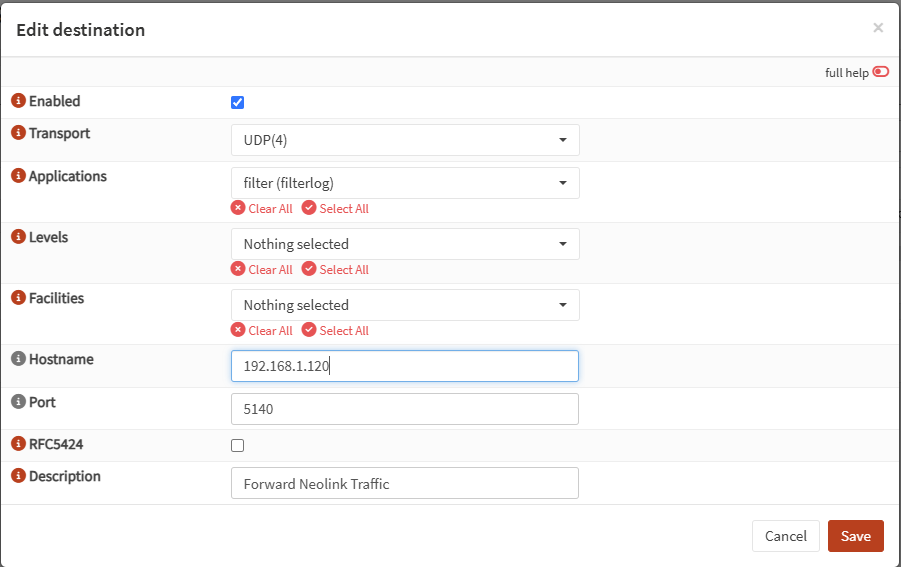

# Battery cameras — setup

> **Beta — under active development.** Validated on real hardware (Argus
> line, battery doorbells), still being tuned. If something misbehaves, open
> an issue with the `[wake-diag]` log lines — that evidence drives the fixes.

Three setups, pick one. UDP-only models (much of the Argus line never listens
on TCP) always need `uid` + `"udp": true`, and in Docker **host networking**
(`network_mode: host`) — see [UDP-only models](#udp-only-models).

## 1. On constant power (solar/USB): `always_on`

```jsonc
{
  "name": "Solar",
  "username": "admin",
  "password": "…",
  "uid": "95270000ABCDEFGH",
  "udp": true,
  "always_on": true
}
```

Done — the camera behaves **exactly like a wired camera**: permanent
connection, unlimited live view, 24/7 recording available, every event caught
live. Nothing else in this guide applies.

## 2. On battery: `wake_capture`

```jsonc
{
  "name": "Solar",
  "username": "admin",
  "password": "…",
  "uid": "95270000ABCDEFGH",
  "udp": true,              // UDP-only model; omit for TCP models
  "wake_capture": true
}
```

The camera sleeps between events to preserve charge. Neolink watches its ping
pattern **without waking it** and connects the moment the camera wakes itself
for motion, recording from the first keyframe. Works with no extra
infrastructure, but it is inference — very short wakes can be missed.

## 3. On battery, with a capable router: wake hints (best)

Keep `wake_capture` on and add the router. On a PIR event the camera calls
Reolink's push service; the router sees it instantly and tells Neolink, which
connects at once — faster and more reliable than the ping scan, and it also
catches events the scan is blind to (e.g. a second trigger right after a
wake).

**Know the limitations before you set this up:**

- **This is a work-around.** Reolink battery cameras currently have no way
  to push events to LAN software — Reolink is building a proper push
  protocol (together with the Home Assistant integration developers), but it
  needs new firmware that does not exist yet. Until it ships, having the
  router report the camera's own cloud push call is the most reliable event
  signal available. When the native protocol lands, Neolink will adopt it
  and this recipe becomes unnecessary.
- **Requires push notifications enabled** for the camera in the Reolink
  app — that is what makes it call the push service at all. You don't have
  to *receive* them: silence them on your phone, or **block** the traffic at
  the firewall — the logged attempt is still the signal (pass+log is the
  tested setup; whether firmware keeps attempting forever under a long-term
  block is untested). With push disabled the camera produces **no
  distinguishable event traffic at all** (its remaining cloud chatter also
  occurs periodically without any event, verified in router logs), so there
  are no hints and the ping scan carries on alone.
- A hint-opened session records for a full **30 seconds** (extended by
  further pushes or ongoing motion), so short events still yield usable
  footage.

In Neolink's config (server level, next to `cameras`):

```json
"wake_hints": {
  "syslog_port": 5140
}
```

### OPNsense

1. Give the camera a **static DHCP lease**.
2. Firewall → Aliases → add: type *Host(s)*, content `pushx.reolink.com`.
3. Firewall → Rules (camera's interface) → add: source = camera IP,
   destination = the alias, **Log packets** checked (pass or block, your
   policy).
4. System → Settings → Logging → **Remote** tab → add:

   | Field | Value |
   |---|---|
   | Enabled | checked |
   | Transport | UDP(4) |
   | Applications | **filter** (filterlog) |
   | Levels | leave empty |
   | Facilities | leave empty |
   | Hostname | the Neolink host's IP |
   | Port | **5140** (must match `wake_hints.syslog_port`) |
   | RFC5424 | either |
   | Description | e.g. "Neolink wake hints" |

   

### pfSense

Steps 1–3 as above, then Status → System Logs → **Settings**: check
**Enable Remote Logging**, remote log server `<neolink-host>:5140`, contents:
**Firewall Events**. Same log format — Neolink parses both.

### Verify

Watch Neolink's log: `Wake hints: listening …` at startup, `receiving syslog
from … — the pipe works` on the first datagram, `Wake hints: router saw
<camera> -> …:443` on each event push. No pipe-works line → wrong port, or
UDP 5140 isn't reaching the container.

Neolink only reacts to new **TCP/443** connections from a configured camera's
IP; everything else in the log stream is ignored. Anything else that knows
the camera is up (a Home Assistant automation, an external PIR) can feed the
same path: `POST /api/cameras/{name}/wake-hint`.

## Settings reference

| Setting | Default | What it does |
|---|---|---|
| `always_on` | unset (auto) | `true`: treat exactly like a wired camera (constant power). `false`: force sleep-friendly even if battery detection fails. Unset: battery cameras sleep, wired stay on. Also in the web UI camera editor. |
| `wake_capture` | `false` | Watch a sleeping camera (without waking it) and connect the instant it wakes itself, so the event is recorded. No effect with `always_on`. |
| `keep_alive_hours` | `0` (off) | Hold the camera awake N hours after startup (0–24), battery cost accepted. Also a slider in the web UI. |
| `uid` | — | Camera UID (Reolink app → device info, or the sticker). Required for UDP. |
| `udp` | `false` | Baichuan-over-UDP transport for models that never listen on TCP (beta). Requires `uid`. |
| `udp_probe` | `false` | Diagnostic: probe UDP discovery while unreachable over TCP and log the exchange — tells you whether a stubborn camera is a UDP-only model. |
| `record` | `true` | Seed for the event-recording switch (the web UI switch wins afterwards). |
| `wake_hints` (server level) | off | `{ "syslog_port": 5140 }` — receive router firewall logs as instant wake signals (setup above). |

## What to expect

- **Events list**: confirmed detections only. Battery cameras usually report
  PIR events as plain **Motion** (same as the Reolink app shows); person/
  vehicle/animal labels appear only when the camera's own AI classifies
  (Smart Detection in the Reolink app). A wake whose detection your
  event-type selection excludes is discarded — keep **Motion** ticked.
- **Timeline**: with *Record wake events* on (default), wake footage lands as
  timeline segments — islands around each wake, honest gaps while it sleeps.
  Zero battery cost (it only tapes frames already flowing).
- **24/7 recording is unavailable** while the camera may sleep — it would
  hold it awake until the battery dies. Set *Always on* to get it.
- **Live view is click-to-watch**: tiles show the last snapshot with a
  **Wake & watch** button; a view runs ~2 minutes (extendable) and the camera
  is released ~10 s after the last viewer leaves. Anything holding it awake
  says so on the tile and in the log (`held awake by …`).
- **SD card**: the camera still records PIR events to its own card while
  asleep, independent of all of the above.
- **Home Assistant**: a dozing camera stays available (retained readings +
  an **Asleep** sensor); polls never wake it; automations fire on confirmed
  events only.

## UDP-only models

Parts of the Argus line never listen on TCP — the log shows `Connection
refused` forever. Set `uid` + `"udp": true`, and in Docker/Podman use **host
networking** (required: the UDP handshake and discovery don't survive a
bridge network — the tell is a discovery sweep listing `172.x.255.255` and
ending in `UDP: SILENCE`). Compose/run snippets: README →
[UDP-only battery models](../README.md#udp-only-battery-models-beta).

## Troubleshooting

| Symptom | Likely cause and fix |
|---|---|
| `Connection refused` forever, no open ports | UDP-only model: set `uid` + `"udp": true`. |
| Discovery sweep ends in `UDP: SILENCE` | Docker bridge network. Use host networking. |
| Camera never reads "armed", wake-capture catches nothing | Ping filtered (look for the fallback line), or something holds the camera awake — read the `held awake by` lines. |
| Repeated `[wake-diag] INCONCLUSIVE` + "it was already up" | The scan misread an idle-awake camera as asleep. Self-heals — watch for the "being more skeptical" line. |
| Events missed while armed | Event-type selection excludes what the camera reports (keep **Motion** ticked). `brief fast-ping blip` lines near the miss = wake too short for the scan (router hints fix this); no lines at all = the camera's own PIR never fired. |
| A second event right after a wake is missed | The scan re-arms only after the camera sleeps again (~40–65 s blind). Router wake hints close exactly this gap. |
| Wake hints configured but nothing happens | No `pipe works` line: wrong port / UDP 5140 not reaching the container. Pipe works but no hints: the pushx rule isn't logging, or the camera IP doesn't match the config. |
| Choppy stream on every client incl. the app | The camera's radio ceiling, not Neolink (logged as a saturation self-diagnosis). |
| First 1–2 s of an event missing | Inherent: the camera must wake and accept a connection first. |
| Battery drains fast | Something holds it awake — the hourly `held awake by` line and the tile chip name it. |

<details>
<summary><b>Deep dive</b> — how sleep watching works, log lines, timings</summary>

### How sleep watching works

These cameras have two sleep stages: **light sleep** (main processor off; a
low-power wake chip still answers discovery — and any connection attempt
through it *boots the camera*) and **deep sleep** (the wake chip is silent
too). Plain ICMP pings are answered in both by the Wi-Fi module,
autonomously, without waking anything — so Neolink watches by **listening,
not knocking**:

1. After the last viewer leaves, the stream parks; a ~15 s settle window lets
   the camera doze.
2. A ping scan (every 3 s) reads the pattern: a dozing camera answers in a
   power-save sawtooth (hundreds of ms, ramping), a woken processor answers
   flat and fast (single-digit ms). Radios that switch off just stop
   answering — also "asleep".
3. Enough sleep-pattern samples → `armed to connect on its next self-wake`.
4. A run of fast replies is the wake edge (the confirm probes burst at 1 s
   once the first fast reply lands); Neolink connects (~1.5 s to first video)
   and records. Where ping is filtered, a sparse transport probe is the
   fallback.

The scan is self-skeptical (fruitless connects make the next arming stricter;
a real catch resets) and the rest of Neolink honors the same radio silence —
while every stream of a sleep-friendly camera is parked, background HTTP/
ONVIF/Wi-Fi polling sends no packets at all.

With router wake hints flowing, the scan also becomes **hint-corroborated**:
these cameras wake their radio every 5–14 minutes for ~20 s of cloud
housekeeping (measured in router logs), which can look identical to a real
wake from the outside. While the router has reported an event push within the
last 2 hours, a scan edge with no accompanying hint is treated as
housekeeping and not connected to — the hint connects us ~4 s after radio-up
when it's real. If hints stop arriving, scan-only connects resume
automatically, so a broken pipe never blinds the scan.

Wake-triggered recordings start **tentatively**: announced and kept only when
a detection the camera's event types allow arrives (~30 s window), labeled by
the detection; otherwise deleted. "Wake" is never an event type — what wakes
leave behind lives on the Timeline.

### Log lines worth knowing

| Log line | Meaning |
|---|---|
| `parked — the recording stream watches for self-wakes…` | Streams released; the camera may sleep. |
| `camera is asleep (ping settled into the power-save pattern) — armed…` | Sleep confirmed; watching for the wake edge. |
| `camera answered the transport probe after an all-silent park` | Ping filtered here; the fallback prober caught the wake. |
| `self-wake — recording tentatively…` | Wake caught; capturing, nothing announced yet. |
| `event started (motion — confirmed self-wake, footage from the wake onward)` | An allowed detection confirmed it; the event is real and announced. |
| `self-wake ended with no matching detection — footage discarded…` | Nothing allowed arrived; the tentative event was deleted. |
| `taping this wake to the timeline (passive — never holds the camera awake)` | The timeline tap is writing a segment from frames already flowing. |
| `held awake by …` (hourly) | Something is spending battery; this names it. |
| `that self-wake connect caught nothing (N in a row) — being more skeptical…` | Self-healing against misread sleep patterns. A real catch resets. |
| `brief fast-ping blip (N sample(s)) ended before the 3-sample wake confirmation` | The radio went flat too briefly to be a confirmed wake. Frequent blips near a miss = wakes too short for the scan; none = the PIR never fired. |
| `wake hint (router saw …) — the camera is calling home for an event` | Router-fed instant wake; connecting at once. |
| `[wake-diag] REAL self-wake / LIKELY OUR PROBE / SUSPECT FALSE ASLEEP / HINT MISFIRE / INCONCLUSIVE` | Post-mortem of each wake with evidence. Paste this into issues. |

### Timings

| What | Value |
|---|---|
| Settle window after parking | ~15 s |
| Wake scan cadence | 3 s, steady |
| Confirm-probe burst after a fast reply | 1 s — wake confirmed ~3–5 s after the radio goes flat |
| "Fast" reply threshold | < 50 ms, 3 in a row |
| Tile view budget | ~2 min (checkbox extends) |
| Idle release after last demand | ~10 s |
| Wake confirmation window (event kept vs discarded) | ~30 s |
| Wake-opened session held for the late detection push | 30 s. Scan-opened: ends early on the first detection. Hint-opened: records the full window; a fresh hint restarts it |
| Router wake hint → connect | immediate; misfire cooldown 15/30/60 s |
| Hint trust window (scan edges without a hint = housekeeping, skipped) | 2 h since the last hint; expires back to scan-only behavior |
| Keep-alive maximum | 24 h |

</details>
