# Installing Neolink.NET on Windows

No Docker, no Home Assistant, no command line — one installer sets up either a
**viewer** for a server you already run, or the **whole system on this PC**:
the server runs as a Windows service that starts with Windows and records your
cameras around the clock, and the desktop app is your window into it.

> Companion guides: the [desktop app](desktop-app.md) (tray, notifications,
> upgrading) and the main [README](../README.md) (features, configuration
> reference).

## 1. Download the installer

Grab the latest `Neolink.NET.Desktop-X.Y.Z-win-x64.msi` from the
**[releases page](https://github.com/borexola/neolink.net/releases)** and run it.

## 2. Get past SmartScreen

The installer is not code-signed yet, so Windows shows *"Windows protected
your PC"*. Click **More info**, then **Run anyway** — you'll also confirm a
standard User Account Control prompt later, where the publisher shows as
*Unknown* for the same reason.

<table><tr>
<td width="50%">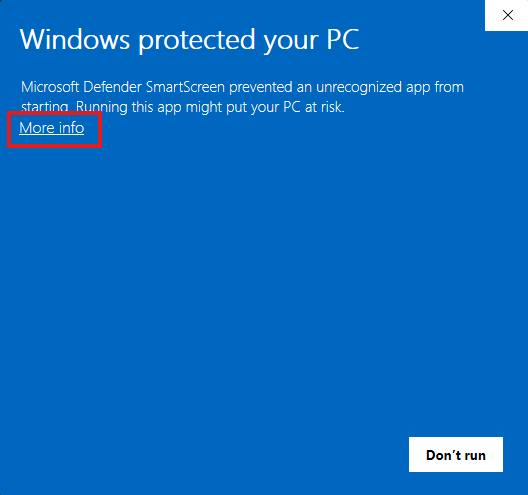</td>
<td width="50%">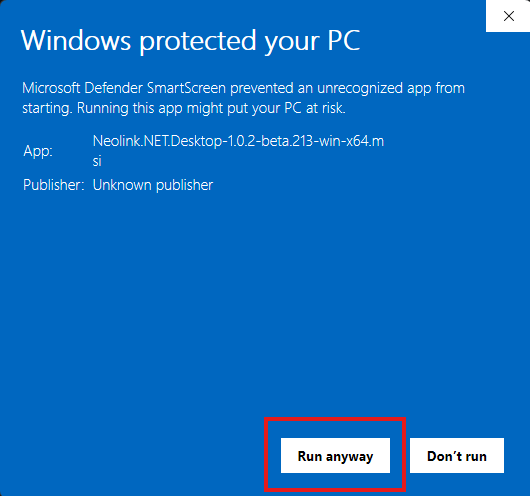</td>
</tr></table>

## 3. Click through the wizard

Welcome, then the license (Neolink.NET is AGPL-3.0 open source):

<table><tr>
<td width="50%">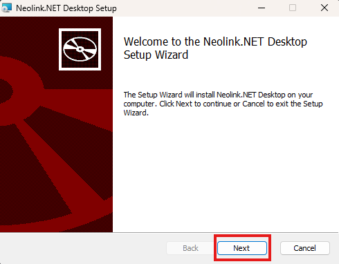</td>
<td width="50%">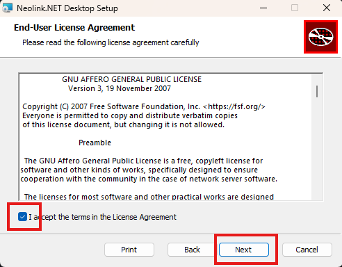</td>
</tr></table>

## 4. Choose what this PC does

This is the one page that matters. Out of the box the installer sets up the
**viewer** — your cameras in a window, connected to a Neolink.NET server you
already have (the Home Assistant add-on, Docker, another PC).

**No server yet? Tick the box.** This PC then becomes the whole system: the
server installs alongside the app and runs as a Windows service — starting
with Windows, recording and serving your cameras around the clock whether
anyone is signed in or not. Phones and other PCs on your network can connect
to it too. Not sure? Leave it unticked — running the installer again later can
add it.

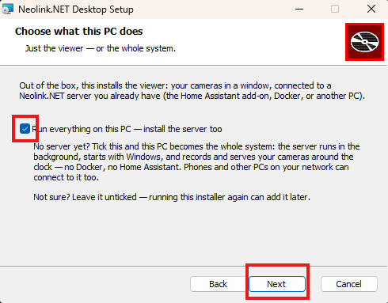

## 5. Install

Pick a folder (the default is fine), click **Install**, and answer **Yes** to
the User Account Control prompt:

<table><tr>
<td width="50%">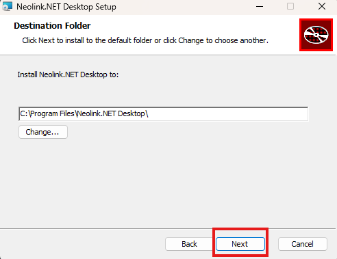</td>
<td width="50%">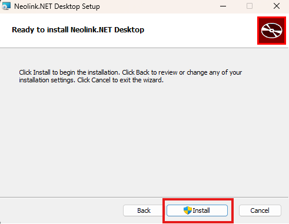</td>
</tr></table>
<table><tr>
<td width="50%">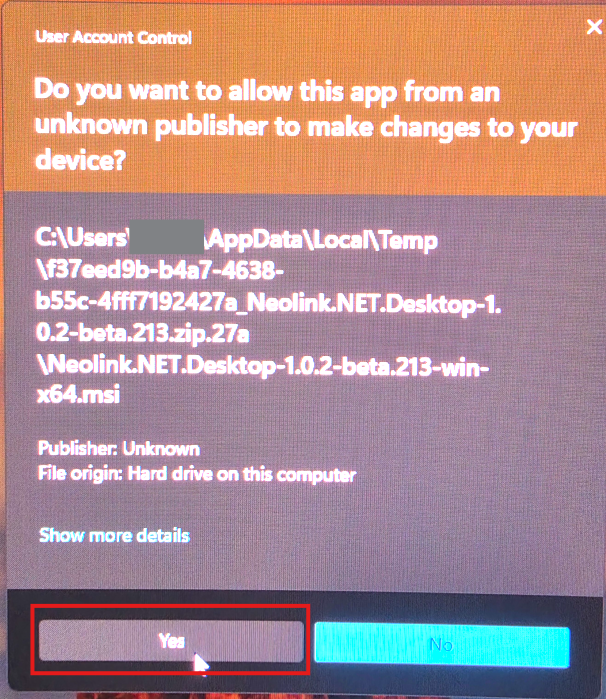</td>
<td width="50%">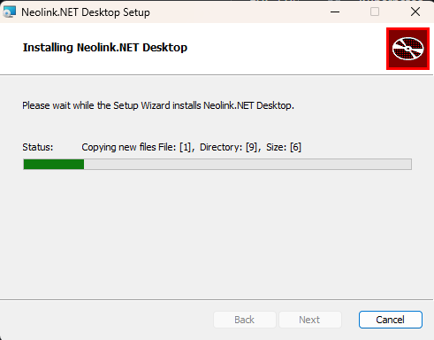</td>
</tr></table>

Leave **Start Neolink.NET Desktop now** ticked and click **Finish**:

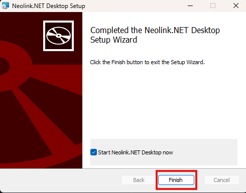

## 6. Connect

The app opens on the connect dialog.

- **Standalone install** (you ticked the box): the address is already filled
  in — `http://localhost:8655` is the server that was just installed on this
  PC. Leave username and password blank and press **Connect**.
- **Viewer install**: type your server's address — the same one you use in a
  browser, like `10.1.0.60:8655` — plus your account if the server has one.
  **Test connection** proves it before you commit.

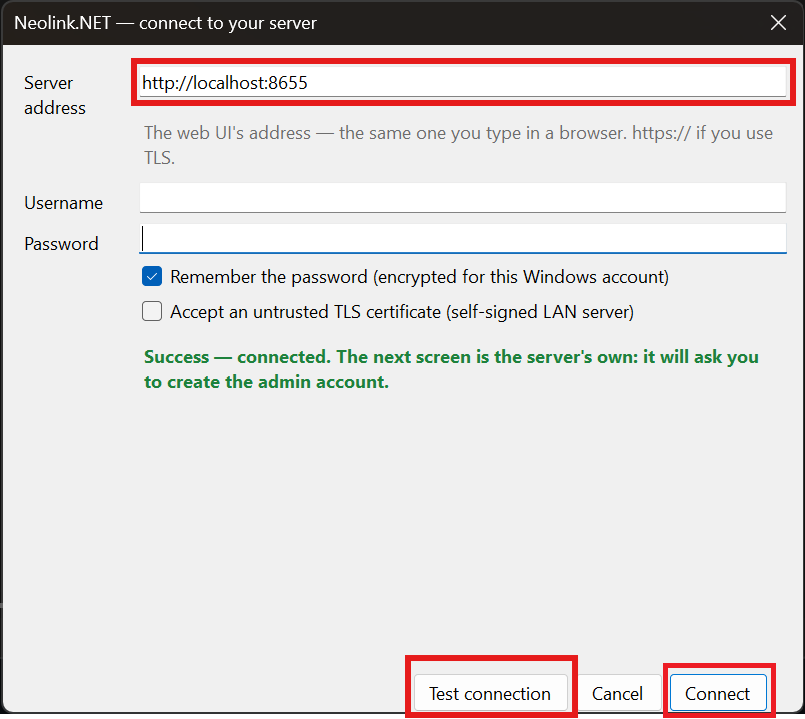

## 7. First run: secure it, then add cameras

On a fresh standalone server, two short steps inside the app finish the job:

1. **Create the admin account** — the server asks on its own ("SECURE THIS
   SERVER"). Pick a username and password; sign-in is required from then on.
2. **Add your cameras** — open **Server settings** (the gear icon, top left),
   add each camera with its IP address and the username/password you use in
   the Reolink app, and restart the server when it prompts you. The wall
   fills in as the cameras connect.

Everything the server owns — config, accounts, recordings — lives under
`C:\ProgramData\Neolink.NET\` and survives upgrades and reinstalls.
Recordings default to a `recordings` folder there; move them to another drive
any time from Server settings.

## Upgrading and uninstalling

Installing a newer MSI over an older one just works: it closes the running
app, keeps your choices (including whether the local server is installed),
and starts things back up. Uninstalling removes the app and the service but
deliberately leaves `C:\ProgramData\Neolink.NET\` behind — your config and
footage are yours; delete the folder yourself if you want them gone.
